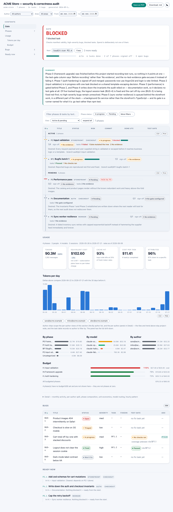

# quality-gates

[](https://github.com/AleksandarBisevac/claude-plugins/actions/workflows/ci.yml)
[](LICENSE)
[](CONTRIBUTING.md#hard-rules)

A [Claude Code](https://code.claude.com) plugin marketplace with one theme:
**enforced** engineering discipline — plan gates, test gates, sign-off gates,
secret guards. Deterministic hooks, not prompt suggestions.

### ▶ The gate, refusing

The plan gate denying an edit no task covers, while a phase is running. Every line is
this plugin's real output — `audit-status.py` renders the plan, `require-plan.py` is fed
the same `PreToolUse` payload Claude Code sends it, and its refusal is what you see.
Re-record with `python3 tools/capture-demo-gif.py`.


### ▶ See it

A live, interactive audit report (search, filter, collapsible phases, Save-as-PDF) — nothing to install:

**[aleksandarbisevac.github.io/claude-plugins](https://aleksandarbisevac.github.io/claude-plugins/)** · or read the [worked example](examples/).

[](https://aleksandarbisevac.github.io/claude-plugins/)

## Plugins

| Plugin | What it does |
|---|---|
| [**audit**](plugins/audit/README.md) | Manifest-driven, model-aware, test-driven audit/fix pipeline: `/audit:status`, `/audit:run`, `/audit:phase` (and siblings) execute phases/tasks from a schema-validated JSON manifest (branch-per-phase, per-task model + skills, red-first TDD bug fixes, gated sign-off), `/audit:init` generates the manifest from a multi-agent codebase audit, `/audit:migrate` shards it into one file per phase for **parallel phases across git worktrees** (fewer tokens per run, conflict-free merges), a `/audit:panel` control panel manages config + composition in the browser, and guard hooks enforce plan-first development, secret safety and a TDD nudge. |

## Install

```
/plugin marketplace add AleksandarBisevac/claude-plugins
/plugin install audit@quality-gates
```

> The guard hooks activate in **all** your projects, by design — but the plan gate is
> **enforced once you have a plan, observing before that**, so installing it does not
> start denying edits in repos that never opted in. See
> [installing arms global hooks](plugins/audit/README.md#installing-arms-global-hooks).
> Requirements: Python 3.8+ reachable as `python3`, `python` or `py` (CI verifies on 3.12)
> (on Windows: run inside Git Bash).

## Quickstart

**Start here — it costs nothing and needs no setup:**

```
/audit:usage --backfill    # reads transcripts already on disk → your own past spend
```

No manifest, no agents, no tokens spent: it scans the Claude Code transcripts already
in `~/.claude/projects/` and prints what this repo has cost you so far, broken down by
model, author and agent. Everything will read as **`unattributed`** — that is the
point. Attributing spend to *phases and tasks* is what the rest of this does, and it
is the comparison a plan-driven pipeline can make that a date-range dashboard cannot.

Then, in any git repo you want to audit:

```
/audit:doctor          # is the setup healthy? interpreter, git root, config, gates
/audit:init            # interview → generates a schema-valid audit manifest
/audit:status          # see phases, tasks, bugs, and what's ready now
/audit:migrate         # (optional) shard the manifest → parallel-safe phases across worktrees
/audit:panel           # open the browser control panel to tune config + composition (open/stop/status)
/audit:phase P0        # run the first phase: branch → tasks (red-first TDD) → gated sign-off
/audit:report          # render the HTML + Markdown report (--share publishes it to a link)
/audit:usage           # the same spend view — now attributed to phases and tasks
```

`/audit:init` interviews you (scope, dimensions, size) and writes the manifest;
everything else reads and updates it. The report is one self-contained file
(open it in a browser, or **Save as PDF**). See the [worked example](examples/)
for what a manifest and its report look like, or the [plugin README](plugins/audit/README.md)
for the full command reference.

Want to try the two UIs before installing anything? The example ships a script
for each — `examples/panel.sh` opens the control panel on it, `examples/report.sh
--open` re-renders and opens the report. No install, no session, no dependencies.

## This repo, dogfooded

`docs/audit/audit-plan.json` is this repository's own roadmap written as an
`audit` manifest — CI validates it with the plugin's own validator on every
push. Open it for a real-world example of phases, tasks, reciprocal bug links
and a fileIndex.

## Docs

- [**Enforcement over persuasion**](docs/essays/enforcement-over-persuasion.md) — why the
  guards are hooks and pinned tool lists rather than firmer wording, the two ways this repo
  got that wrong, and what enforcement cannot do
- [Plugin README](plugins/audit/README.md) — install, quick start, configuration, extending
- [CHANGELOG](CHANGELOG.md) · [SECURITY](SECURITY.md) — threat model & what the guards do NOT guarantee · [CONTRIBUTING](CONTRIBUTING.md)
- [PLUGIN-BUILD-GUIDE](PLUGIN-BUILD-GUIDE.md) — how this plugin is put together, file by file

License: [MIT](LICENSE)
