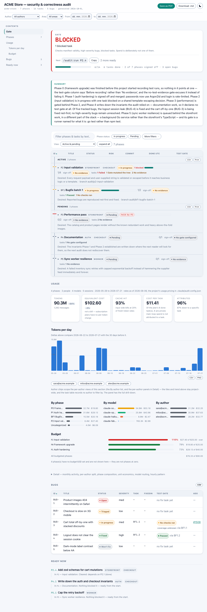

# quality-gates

[](https://github.com/AleksandarBisevac/claude-plugins/actions/workflows/ci.yml)
[](LICENSE)
[](CONTRIBUTING.md#hard-rules)

A [Claude Code](https://code.claude.com) plugin marketplace with one theme:
**enforced** engineering discipline — plan gates, test gates, sign-off gates,
secret guards. The guards are deterministic hooks; the pipeline they govern is an
orchestrator prompt — [which is which, row by row](#what-is-enforced-and-what-is-followed).

**It keeps Claude Code inside the plan you approved**, with test-gate evidence
committed beside that plan so `git` — not the chat transcript — is what you check
when someone claims a step passed. It is built for multi-day work against an
existing codebase that already has tests, picked back up across sessions; a plan
is the thing you approve once and the model is held to afterward.

- **A plan a tool refuses to let you leave.** Once a phase is running, an edit
  outside its tasks is denied before the write lands, not merely flagged after.
- **An evidence record that survives the session.** Every gate run is written to
  a ledger committed beside the plan, so "the tests passed" outlives the chat
  that made the claim.
- **Guards that see intent, not I/O.** Once a phase is running, a write no task
  covers is refused by the resolved path it writes to. A secret-file read is
  judged the way every guard here works, at every tier — by matching the tool
  call's *text*, never the bytes that move: a call naming a secret file beside a
  read verb the guard lists is refused, and two classes stay open — a read that
  never names the file, and an unlisted verb naming it. So pair it with Claude
  Code's own sandbox
  ([what that leaves open →](SECURITY.md#secrets-friction-and-evidence-not-containment)).

**Enforced by hooks:** out-of-plan edits — the plan gate observes with no plan,
warns with a plan and nothing running, and denies while a phase runs
(`/audit:doctor` prints the active tier); secret-file reads, by name
([open classes](SECURITY.md#known-bypass-classes-accepted-documented)); token
dumps. **Followed from instructions, not guaranteed:** branch per phase, red-first
bug fixes, sign-off order.
[Which is which, row by row →](#what-is-enforced-and-what-is-followed)

It governs **one repository at a time, deliberately** —
[COMPATIBILITY.md](COMPATIBILITY.md) names what that boundary leaves out.

**Who does not need this:** a short, solo session on a greenfield project with
nothing yet to protect; a repository with no test suite for a gate to run
against; anyone who wants *containment* of the model rather than *guardrails*
it agreed to stay inside — that is Claude Code's own sandboxing, not this
([SECURITY.md](SECURITY.md)).

**[Install](#install)**, then follow **[QUICKSTART.md](QUICKSTART.md)** — one
page, whose early, read-only `/audit:doctor` step checks the install before
anything is written.

### ▶ The gate, refusing

A recorded Claude Code session against a small demo plan, with this plugin loaded. The
user runs `/audit:status`, asks for an edit the running task covers and it goes through,
then asks for an edit no task covers and Claude Code shows the plan gate's refusal. The
session is real; CI replays the refused edit against the gate on every push and fails if
the refusal no longer reads the way the recording shows it.


### ▶ See it

A live, interactive audit report (search, filter, collapsible phases, Save-as-PDF) — nothing to install:

**[aleksandarbisevac.github.io/claude-plugins](https://aleksandarbisevac.github.io/claude-plugins/)** · or read the [worked example](examples/).

[](https://aleksandarbisevac.github.io/claude-plugins/)

## Plugins

| Plugin | What it does |
|---|---|
| [**audit**](plugins/audit/README.md) | Manifest-driven, model-aware, test-driven audit/fix pipeline: `/audit:status`, `/audit:run`, `/audit:phase` (and siblings) execute phases/tasks from a schema-validated JSON manifest (branch-per-phase, per-task model + skills, red-first TDD bug fixes, gated sign-off, every gate run written to a committed evidence ledger), `/audit:init` generates the manifest from a multi-agent codebase audit, `/audit:layout` switches the manifest between one file and one file per phase — the sharded shape gives **parallel phases across git worktrees** (fewer tokens per run, conflict-free merges) and the command goes back the other way too, a `/audit:panel` control panel manages config + composition in the browser, and guard hooks enforce plan-first development, secret safety and a TDD nudge. |

## What is enforced and what is followed

Two halves, and they hold in different ways. The **guards are hooks**: a `PreToolUse`
handler returns a decision and the tool call does not happen. The **pipeline is a
prompt**: `plugins/audit/reference/orchestrator.md` is the execution core, read by the
model on every `/audit:*` call, and its invariants are instructions rather than
guarantees. Both columns below are the real thing; only the left one holds when the
model does not comply.

The left column has two kinds of row. Most are a hook refusing a tool call **before** it
happens. The last few are a script returning an exit code **after** it did —
`scripts/governance/verify-invariants.py`, which re-derives those rules from git, the
phase shard, the journal, the usage ledger and the test-evidence record, and which Phase
sign-off and `/audit:status --gate --fail-on invariant-breach` both run. A rule nothing
can refuse in advance is still enforced if a breach cannot pass a gate; a rule nothing
checks at all is policy, and that is what the right column is.

| Enforced by a hook (before) or a script (after) | Followed from `orchestrator.md` |
|---|---|
| A call naming a secret file beside a read verb the guard lists is refused; a read that never names the file, and an unlisted verb naming it, stay open ([SECURITY.md](SECURITY.md#known-bypass-classes-accepted-documented)) | Human confirmation before a `reset` / `rebase` / `clean` |
| Env values and token variables — never dumped | `risk: "high"` waits for a human before committing |
| Shell writes into source files no task covers | Revalidate the manifest after **every** write |
| Commits the manifest records — never orphaned | `attempts >= maxAttempts` sets `blocked` |
| Skills, subagents and MCP tools — the project's `policy` | An infrastructure failure burns no retry |
| Auth tokens — never logged | Red-first TDD where `tests.mode` asks for it |
| The project's own banned patterns, per path | The executor never commits; the orchestrator does |
| The plugin's own files — not editable by the model | Run only what the readiness rule allows |
| The plan-first bypass — armed from human prompts only | Parallel only on disjoint file sets |
| The audit trail — append-only, no hand edits | Take the narrowest lock, and stop on exit 3 |
| Non-trivial edits — planned, or explicitly opted out | Sign-off in strict order: review → gates → boot |
| Manifest writes against another live session's lock | `--ff-only` into the resolved parent, never a rebase |
| Every plan and config write — journalled, hash-chained | `git -C <gitRoot>`; gate commands from the project dir |
| Token spend — attributed to a phase and a task | Spawn the executor with the task id in its description |
| Unaccounted shell writes in the watched tree — reported in-band, where a plan exists to be outside of | Skills invoked before any code is written |
| Source changed with no test — nudged | Every gate run goes through the recorder, not by hand |
| Explorer cannot write, reviewer cannot edit, executor has no web tools |  |
| The manifest — referentially validated, by exit code |  |
| *(after)* A task commit staged that task's files, its phase's shard, the journal and the evidence record — never the index |  |
| *(after)* An audit-state commit carried the record of a run and none of the work |  |
| *(after)* A committed `testEvidence` pointer names a run the repository actually holds |  |
| *(after)* No `push` reached a remote from the phase branch |  |
| *(after)* No forced update and no `git stash` touched the phase branch |  |
| *(after)* A `risk: "high"` task ran on neither a declared nor a metered `haiku` |  |
| *(after)* `phase.baseRef` is on the branch the phase forks from |  |

The right column is not one thing. Some of it is **verifiable after the fact** and simply
has no checker yet; some of it is verifiable by **nothing at all** — a human confirmation
that never happened leaves no trace, and a reverted `attempts` increment is the same
number as one that never happened. Which is which matters before you rely on a row, so the
[plugin README](plugins/audit/README.md#what-is-enforced-and-what-is-followed) gives the
per-rule version of both tables: for each enforced rule, the hook or script and the
decision it returns; for each invariant, where it is written and what evidence would catch
a breach. [SECURITY.md](SECURITY.md) has the fail modes and the accepted bypass classes.

## Install

```
/plugin marketplace add AleksandarBisevac/claude-plugins
/plugin install audit@quality-gates
```

> The guard hooks activate in **all** your projects, by design — but the plan gate
> observes with no plan, warns with a plan and nothing running, and denies while a
> phase runs (`/audit:doctor` prints the active tier), so installing it does not
> start denying edits in repos that never opted in. See
> [installing arms global hooks](plugins/audit/README.md#installing-arms-global-hooks).
> Requirements: Python 3.8+ reachable as `python3`, `python` or `py` (CI verifies on 3.12)
> (on Windows: run inside Git Bash).

## Try it with no setup

**[QUICKSTART.md](QUICKSTART.md) is the whole path** — install, the read-only
`/audit:doctor` check, a first look at what this repo has already cost you
(`/audit:usage --backfill`: no agent, no analysis, one ordinary turn), and on to a
rendered report: one page, in order, and it stops there. It is deliberately not
repeated here: this page is the pitch, and a command list in two places is one list
and one lie.
Want to try the two UIs before installing anything? The example ships a script
for each — `examples/panel.sh` opens the control panel on it, `examples/report.sh
--open` re-renders and opens the report. No install, no session, no dependencies.

## This repo, dogfooded

`docs/audit/audit-plan.json` is this repository's own roadmap written as an
`audit` manifest — CI validates it with the plugin's own validator on every
push. Open it for a real-world example of phases, tasks, reciprocal bug links
and a fileIndex.

## Docs

Ordered by what you are here to do, because the reference documents are long and
none of them is the place to start.

**Getting it running**

- [QUICKSTART](QUICKSTART.md) — install → first audited task → first report. One page.
- [**Handbook**](https://aleksandarbisevac.github.io/claude-plugins/handbook.html) — the
  operating guide, hosted: the model, running phases, shaping the plan, the ADO connector,
  the panel, what the trail records, and a command reference. Written against the plugin
  rather than any one repository, so it is the page to send a teammate
- [Plugin README](plugins/audit/README.md) — the deep reference, once it is running:
  every command, every config key, the control panel, token usage, the audit trail

**Deciding whether to depend on it**

- [COMPATIBILITY](COMPATIBILITY.md) — what a version number promises about the
  manifest and the config file *you* own, and where the promise stops
- [SECURITY](SECURITY.md) — threat model, fail modes, and what the guards do NOT guarantee
- [**Enforcement over persuasion**](docs/essays/enforcement-over-persuasion.md) — why the
  guards are hooks and pinned tool lists rather than firmer wording, the two ways this repo
  got that wrong, and what enforcement cannot do
- [CHANGELOG](CHANGELOG.md) — what changed, release by release

**Working on it**

- [CONTRIBUTING](CONTRIBUTING.md) — start here: the gates to run and the rules that
  are enforced rather than requested
- [PLUGIN-BUILD-GUIDE](PLUGIN-BUILD-GUIDE.md) — how this plugin is put together, file by file

License: [MIT](LICENSE)
