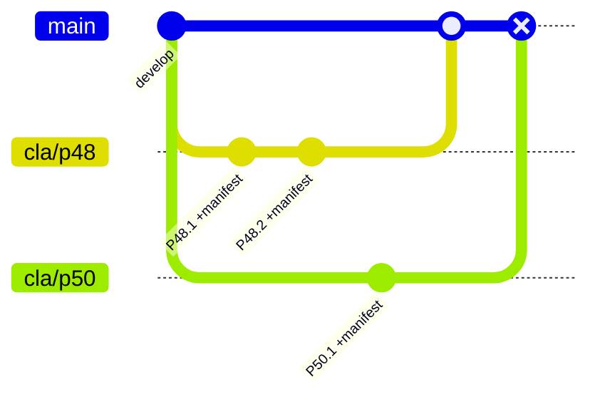
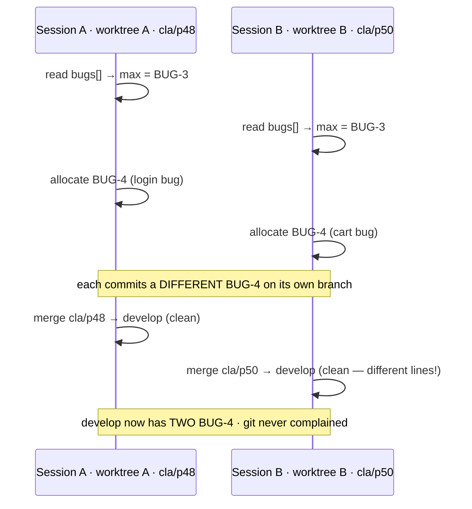
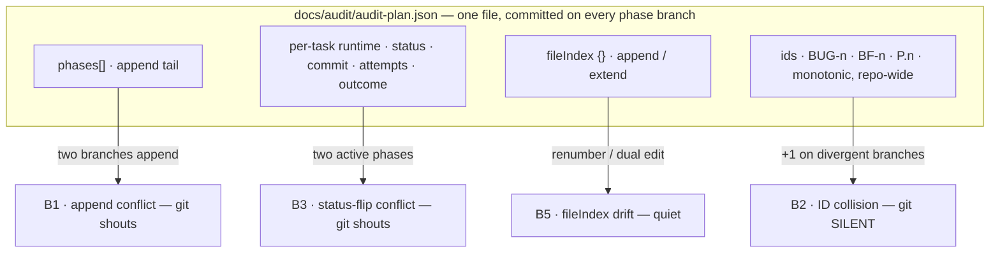

# Audit pipeline — concurrency & branching failure modes

> **Status:** decision-support report. Catalogues the problems that appear when `/audit:*`
> work is parallelized across branches / sessions, plus the options on the table.
> **No decision is made here** — it exists so we can make one with eyes open.
>
> Anchored in a real case: **PR #380** (`db-embed-platform`, `docs/audit/cla-plan.json`) —
> continuing new work while a phase PR is open. Every claim is cited to the plugin's own
> code (`plugins/audit/reference/*`, `schema/`).

---

## Implementation status — measured 2026-08-07 (v0.25.0)

The catalogue below is kept as written, at the architecture it described (single-file
manifest, `<manifestPath>.lock`), because a report that quietly edits its own premises
cannot be checked against what happened. **That architecture no longer exists**, and one of
this report's central claims did not survive contact with it.

### What shipped

| Option | Status | Where |
|---|---|---|
| **O4** per-phase sharding | **shipped** v0.15.0 | `meta.version: 3`; phases are `{id, title, shard}` stubs pointing at `phases/<id>.json`. Every runtime field lives in the phase's own shard |
| **O5** cross-worktree lock | **shipped** | `$(git rev-parse --git-common-dir)/audit-locks` — outside the working tree, shared by all worktrees of one clone, invisible to `git status` |
| — two-tier locking | shipped, not in this report | brief `index.lock` for structural writes and id allocation; `phase-<id>.lock` held for a phase run. Different phases take different locks and run in parallel |
| — `phase.claim` | shipped, not in this report | `{sessionId, host, branch, at}` in the shard: optimistic **cross-machine** coordination, so a same-phase double-claim on another branch surfaces as a shard merge conflict |
| **C3** atomic write | **fixed** | `_manifest_io._atomic_write_json` — temp file + `os.replace` |
| **O2** id namespacing | **not implemented**, and see below | ids are still "highest + 1" (`manifest-conventions.md:59-73`) |

### B2 is no longer silent — the headline claim is retracted

This report's central argument was that **B2 (ID collision) merges cleanly and git never
complains**, which is what put it top-right in the risk matrix. Measured against the current
architecture with real clones and real merges, that is **false**.

Sharding moved every id-allocating write — `bugs[]`, `phases[]`, `fileIndex` — into the
**index**, under the index lock. Two allocations of the same kind therefore land on the same
array tail, in the same hunk:

| Measured scenario (two separate clones, no shared lock) | Result |
|---|---|
| Both allocate `BUG-4` from the same base, commit, merge | **CONFLICT** — `CONFLICT (content): Merge conflict in docs/audit/audit-plan.json` |
| Both add a task to their own phase **and** extend the shared `fileIndex` | **CONFLICT** |
| Each runs its **own phase**, writing only its own shard | **clean merge**, both shards intact, index untouched |

The third row is O4 working exactly as designed, and it is the scenario the product
advertises. The first two are B2 and B5 — and git announces both.

Task ids close the remaining surface by construction: `<phaseId>.<n>` is scoped to a phase,
so two clones running *different* phases cannot mint the same task id even in principle, and
two clones running the *same* phase collide inside one shard, which conflicts.

No silent duplicate-id path could be constructed in the sharded layout. A collision requires
two allocations of the same kind, which requires the same array, which is the same hunk.

### What that does to the options

- **O2 (id namespacing) is not recommended.** Its whole justification in §5 was that B2 is
  silent. It is not, so O2 would add a prefix or a random suffix to every id — `BUG-4`
  becomes something worse to read and to type, permanently — in exchange for a collision git
  already reports. The cheap mitigation the matrix lists under O1 (run `validate-manifest.py`
  after a merge) still works and is still worth doing: two `BUG-4` entries produce
  `FINDING: duplicate id: BUG-4`.
- **O1 discipline** remains the answer for the merge-conflict modes, which are now the only
  modes.

### C1 — closed 2026-08-07 (v0.26.0), and it was worse than this report said

**C1 was answered by removing the threshold from the decision, not by tuning it.** The
60-minute rule is a proxy for "is the holder still alive", and measuring it showed it wrong
in *both* directions — this report only recorded one:

- **False stale** (what the matrix caught): a healthy 90-minute run reads as crashed. This
  report rated the likelihood **Low**. That was too kind. The protocol says human-confirmation
  pauses KEEP the lock, and a phase run pauses for the human at least three times (a
  `risk: "high"` task, a budget at 100%, the review sign-off). A run that asks a question and
  gets an answer after lunch is stale by the protocol's own definition while perfectly healthy.
  The **doctor manufactured the same mistake**: it reported any lock over 60 minutes as stale,
  telling the human to take over the run that was working.
- **False fresh** (not in this report at all): a run that crashes after ten minutes holds its
  lock for the remaining fifty, and the next session is told to wait for nothing.

**What was measured before designing anything** (sandbox at
`.claude/jobs/*/tmp/c1`, a real repo, sharded manifest, two sessions):

| Step | Observed |
|---|---|
| B reads a 95-min lock | offered a takeover — and `phase.claim` names `sess-A` right beside it, which nothing in the acquire protocol reads |
| B overwrites the lock and claims the phase | no error, no warning, no conflict — one working tree, so git never sees two versions |
| A, still alive, writes `P1.1 = done` | **accepted.** Nothing checked the lock; nothing checked the claim |
| A releases at the end of its run | **deleted B's lock**, and neither session ever learned |

The root cause was structural: **the lock was taken, judged and released entirely by the
orchestrator's prose.** No script acquired it, `_manifest_io`'s write path knew nothing about
it, and all three code references (`audit-doctor.py`, `audit-usage.py`, `panel-server.py`)
only read it. A convention nobody can execute is not a lock.

**The fix** is `plugins/audit/scripts/audit-lock.py` — acquire/release/status with exit codes,
and the verdict in code:

| Holder | Verdict |
|---|---|
| same host, recorded pid alive | **live** — refuse at any age |
| same host, recorded pid gone | **abandoned** — offer takeover at once, no waiting |
| no pid, or another host | fall back to the age rule, unchanged |

Same-host is the right jurisdiction and not a compromise: this lock lives in the shared git
dir, so it only ever coordinated worktrees and clones of **one machine** — `phase.claim` and
the shard merge conflict are what cover the rest. Every uncertainty resolves to *live*: a false
"dead" is two writers and a corrupted shard, a false "alive" is a refusal the human clears by
deleting one file. Also fixed along the way: acquire is `O_CREAT|O_EXCL` (the prose's
check-then-write had a window), and **release refuses when the lock is no longer yours** —
which is how a taken-over session finds out, instead of silently deleting the winner's lock.

The doctor, the panel badge and the usage backfill lock now share that one verdict rather than
keeping three copies of the threshold. 79 new selftest cases.

**The write path enforces it, from v0.27.0.** `require-plan.py` refuses a write to the
manifest or a phase shard while another **live** session holds the governing lock, so ignoring
an exit 3 no longer buys you a write. It is the plugin's first denial keyed on session
identity, and the scope is deliberately narrow — everything unattributable allows:

| Situation | Verdict |
|---|---|
| No lock, or a lock with no `sessionId` | allow — an unattributable lock must never deny |
| The lock is this session's | allow |
| Another session, pid alive on this host | **deny**, naming the holder and the basis |
| Another session, pid gone | allow, with a notice that the lock is still there |
| No git, unreadable lock, module missing | allow |

An abandoned lock does not deny on purpose: nobody is writing against you, so blocking would
add friction after a crash and protect nothing. `guard-bash-writes` reports the same conflict
for a `sed -i`, after the fact, since a shell write cannot be caught before it lands — which
keeps this inside the already-documented bypass class 1 rather than opening a new one.

Cost, measured: **0.14 ms** on an ordinary source edit (the check does not fire — nothing but
manifest paths has a governing lock) and **19 ms** on a manifest write, of which 11 ms is
`git rev-parse --git-common-dir`. Not optimised: a hand-rolled git-dir resolver would be a
second implementation of something git already answers, and this session was spent removing
exactly that kind of duplication.

**What is still not enforced:** that you take a lock at all. A session that simply never
acquires one writes freely, because denying an unlocked manifest write would break `/audit:init`,
hand edits, and every read-only-turned-write path. The lock is honoured, not required.

### What is still open

- **Clones and separate machines are still outside the lock.** `--git-common-dir` is shared
  by worktrees of one clone and by nothing else — verified by comparing absolute paths. What
  changed is the consequence: an unlocked concurrent run now produces a conflict you must
  resolve, not a corruption you never notice. `phase.claim` covers the cross-machine
  same-phase case by the same mechanism.
- **Likelihood, for this repository, measured the same day:** no project using the plugin has
  more than one worktree, and no repository on this machine is cloned twice. The precondition
  for the entire B class — two mutating sessions without a shared lock — does not currently
  occur here.

---

## TL;DR

The audit **manifest** (`docs/audit/audit-plan.json`) is a *single JSON file* that plays four
roles at once:

1. **Source of truth** for phases/tasks/bugs (`manifest-conventions.md:9-11`)
2. **Concurrency serializer** via a lock file (`orchestrator.md:112-131`)
3. **Committed artifact** — staged on *every phase branch*, on *every task commit* (`orchestrator.md:12-13`)
4. **ID allocator** — monotonic "highest + 1" ids, repo-wide (`manifest-conventions.md:50-54`)

The lock guards **one clone**. The moment you parallelize phases across **branches, worktrees, or
clones**, roles 3 and 4 turn the one shared file into a collision surface. The intuitive worry is
merge conflicts — but git *shouts* about those. The dangerous one is the failure git stays **silent**
about: two branches independently allocating the **same id**.

---

## 1 · How it works today

Understanding four mechanics explains every failure mode below.

**Branch-per-phase.** A phase forks a local branch off `meta.developmentBranch`, commits per task,
and merges back (ff, else confirmed `--no-ff`) (`orchestrator.md:133-147`). Push is forbidden;
it's local-only.

**Every task commit carries the manifest.** The orchestrator invariant: *"commit only a task's own
`files` + the manifest"* (`orchestrator.md:12-13`). So each phase branch accumulates commits that
**all edit `audit-plan.json`** — status flips, the new `commit` SHA, `attempts`, `outcome`.

**One lock, one file.** Mutating commands (`next`/`run`/`phase`/`review`/`resume`, plus
`init`/`task`/`bug`/`sync`) take `<manifestPath>.lock`: refuse if younger than 60 min, offer
takeover if older (`orchestrator.md:112-131`, `manifest-conventions.md:28-48`). The lock is a plain
file next to the manifest — so it only exists, and is only seen, **within that one working copy**.

**IDs are monotonic and global.** `<phaseId>.<n>`, `BUG-<n>`, `BF<n>` are each "highest existing +
1", repo-wide (`manifest-conventions.md:50-54`). `fileIndex` is append/extend on task add,
validated bidirectionally (`manifest-conventions.md:80-83`).

*`main` = the trunk (`develop`). Both phase branches edit the same `audit-plan.json`; the second
merge (marked) is where they meet.*

---

## 2 · What is actually safe

Not everything is fragile — the plugin serializes deliberately, and one form of parallelism is
built-in and safe:

- **Within-phase task parallelism (one session).** The orchestrator already spawns multiple
  executor agents at once for tasks whose `files` are **disjoint** and whose `dependsOn` are
  satisfied (`orchestrator.md:109-110`). This is the supported, safe parallelism.
- **One session per clone.** With a single working copy, the lock does its job: a second mutating
  command is refused, so you can't corrupt the manifest by accident.

Everything below is about stepping **outside** those two guarantees — i.e. two mutating sessions,
which only becomes possible across separate worktrees/clones.

---

## 3 · Failure-mode catalog

Grouped by where the guardrail stands. **The key column is "git's reaction"** — a conflict is
annoying but self-announcing; a silent clean merge is the trap.

### Class A — same clone (the guardrail works)

| ID | Trigger | What happens | Severity |
|----|---------|--------------|----------|
| **A1** | Second mutating `/audit:*` in the same clone | **Refused** — lock younger than 60 min (`orchestrator.md:119-121`). Working as designed. | — (prevention) |
| **A2** | Two sessions forced onto one working tree | Can't hold two phase branches at once; subagents overwrite each other's files. Prevented by A1 + "one session per clone". | — (prevention) |

### Class B — multi-worktree / multi-clone (the lock is blind)

The lock is a per-file mutex in one working copy, so separate worktrees/clones each hold their
**own** lock and run **simultaneously, unaware of each other**. That is the root cause of this whole class.

**B1 · Structural append conflict** &nbsp;·&nbsp; *git conflict — trivial* &nbsp;·&nbsp; **sev Low / likelihood High**
Two branches each append a phase/task → both edit the tail of `phases[]` (and `fileIndex`).
Git flags a conflict at the array boundary. **This is the PR #380 case.**
*Repro:* branch A and B both run `/audit:phase` creating a new phase, or `/audit:task add`.
*Resolve:* keep both blocks + both `fileIndex` entries, re-run `validate-manifest.py`. Annoying, not dangerous.

**B2 · ID collision** &nbsp;·&nbsp; *git SILENT — no conflict* &nbsp;·&nbsp; **sev High / likelihood High** &nbsp;·&nbsp; **headline hazard**
> **RETRACTED 2026-08-07 — see the status block at the top.** "git SILENT" was true of the
> single-file layout this paragraph describes. Under sharding every id-allocating write goes
> to the index, so two allocations of the same kind share a hunk and git reports a conflict.
> Measured with real clones and real merges. The paragraph is left standing because it is
> what the report argued at the time.
Allocation is "highest + 1", repo-wide (`manifest-conventions.md:50-54`). Two branches forked from
the same point both see `BUG-3` as the max and both allocate **`BUG-4`** (or `BF2`, or `P2.5`) — to
*different* work. Because they touch different lines, **git merges cleanly with no conflict marker**.
The result is two entities sharing one id. `validate-manifest.py` catches it *if you run it after the
merge* (unique-id check); if you don't, the reciprocal links, `fileIndex`, and every report silently
point at the wrong thing.

**B3 · Runtime status/commit flip conflict** &nbsp;·&nbsp; *git conflict* &nbsp;·&nbsp; **sev Med / likelihood High**
Both active phases rewrite per-task `status`/`commit`/`attempts`/`outcome` in the same file on their
branches (`orchestrator.md:12-13`). Merging back collides on those JSON regions. Mechanical to
resolve (union both phases' updates) but it happens on essentially *every* concurrent run.

**B4 · Reciprocal-link divergence** &nbsp;·&nbsp; *conflict or silent* &nbsp;·&nbsp; **sev Med / likelihood Med**
`/audit:bug fix` materializes a bug into a `BF<n>` phase and writes the reciprocal
`bug.taskId ↔ task.bugId`. Done independently on two branches, you get duplicate `BF` phases (a B2
variant) and/or a link that only half-exists after merge — a validator finding.

**B5 · fileIndex drift** &nbsp;·&nbsp; *silent* &nbsp;·&nbsp; **sev Med / likelihood Med**
`fileIndex` is bidirectional (`manifest-conventions.md:80-83`). A B2-style renumber, or independent
edits to the same `fileIndex` object, leave it pointing at task ids that changed — a bidirectional
integrity finding, or a silently wrong file→task map.

### Class C — lock semantics

| ID | Issue | Effect | Severity |
|----|-------|--------|----------|
| **C2** | Lock is a per-file, advisory mutex | **No protection across worktrees/clones** — the root cause of all of Class B. | High (structural) |
| **C1** | 60-min staleness threshold | A legitimate long run (>60 min) looks "crashed"; another session offers a takeover and both then mutate. | Med / likelihood Low — **the likelihood was wrong; see the C1 section above**. Closed v0.26.0 |
| **C3** | Manifest write isn't atomic | A crash mid-write can leave malformed JSON; softened (not removed) by the edit-and-revalidate rule (`manifest-conventions.md:17-26`). | Low |

### The conflict surface

Every failure maps to a region of the one file:

---

## 4 · Severity × likelihood

Position is the risk (bottom-left calm → top-right hot). B2 sits top-right precisely because it is
*both* likely under real parallel work *and* silent.

| Likelihood ↓ \ Severity → | Low | Medium | High |
|---|---|---|---|
| **High** | B1 (append) | B3 (status flip) | **B2 (ID collision)** |
| **Medium** | — | B4 (links) · B5 (fileIndex) | — |
| **Low** | C3 (atomicity) | — | C1 (stale takeover) — re-rated, see above |

*C2 (lock is blind across clones) isn't an event — it's the structural precondition that makes the
whole B column possible.*

---

## 5 · Options on the table

Presented neutrally with trade-offs — **no recommendation**. The coverage matrix says which failure
modes each option actually removes vs. merely copes with.

**O1 · Workflow / discipline only** — *zero code change.*
Branch independent work from `develop` (not from the open phase branch); stack + rebase only when
work genuinely depends on unmerged code; run `validate-manifest.py` after every merge (catches B2/B4/B5);
`git rerere` to memoize repetitive resolutions; keep one active *mutating* session at a time. Cheap,
but relies on humans remembering — nothing is *fixed*, only mitigated.

**O2 · ID namespacing** — *small, targeted.*
Make allocation collision-proof: per-branch/per-phase id prefixes (or a random suffix) so two
branches can never mint the same id. Fixes **B2** (and the B4 duplicate-`BF` variant) at the source.
Touches the allocation rule in `manifest-conventions.md` + the `task`/`bug` commands. Doesn't help
the merge-conflict modes.

**O3 · Plan/state split** — *medium refactor* (the sketch from the earlier discussion).
Move volatile runtime fields (`status`/`commit`/`attempts`/`outcome`; phase `branch`/`baseRef`/…)
into per-phase `state/<phaseId>.json`. Each phase writes only its own state file → **B3 fixed**, B1/B5
softened. The plan file stops churning. Doesn't fix B2 (still needs O2). Touches ~7 files + migration
+ back-compat.

**O4 · Per-phase manifest sharding** — *structural, larger.*
One file per phase instead of one array. Structurally removes **B1/B3/B5** (phases never share a
file). Still needs O2 for **B2** (global id counter). Biggest blast radius: readers, validator,
panel, reports all change.

**O5 · Cross-worktree lock** — *addresses the root, not the symptom.*
Make the mutex effective beyond one clone (shared lock location / committed coordination lock).
Fixes **C2** by *serializing* — i.e. it prevents concurrent runs rather than making them safe, so it
removes the B class by removing the parallelism. Useful if the goal is "never run two at once,
reliably," counter-productive if the goal is real parallelism.

### Coverage matrix

| Option | B1 append | B2 id-collision | B3 status | B4 links | B5 fileIndex | C2 cross-clone | Cost |
|---|---|---|---|---|---|---|---|
| **O1** discipline | cope | cope (validate) | cope | cope | cope | cope | none |
| **O2** id namespacing | — | **fix** | — | **fix** | — | — | low |
| **O3** plan/state split | soften | — | **fix** | partial | soften | — | medium |
| **O4** phase sharding | **fix** | — | **fix** | partial | **fix** | — | med-high |
| **O5** cross-worktree lock | prevents¹ | prevents¹ | prevents¹ | prevents¹ | prevents¹ | **fix** | medium |

*¹ O5 removes these by disallowing concurrency, not by making concurrent work safe. Combinations are
viable — e.g. **O2 + O3** fixes B2 + B3 and softens the rest while keeping parallelism.*

---

## Appendix

### A · The PR #380 prompt (real, verbatim excerpt)

> *"great, quick question. I want to continue to work on other tasks until this one is merged.
> Should I create a new branch from this branch? or"*

The guidance given — branch from `develop` for independent work, stack only for dependent work — is
**O1**. The heads-up it included ("every phase appends to the single `cla-plan.json` … two branches
that both add a phase will likely produce a small merge conflict … trivial to resolve") is exactly
**B1**. This report's addition is **B2**: the same "+1" mechanic, one step more dangerous, because
git won't warn you.

### B · Citations

| Claim | Source |
|---|---|
| Manifest = single source of truth | `plugins/audit/reference/manifest-conventions.md:9-11` |
| Lock protocol (60-min, takeover) | `orchestrator.md:112-131` · `manifest-conventions.md:28-48` |
| Per-task commit stages task files + manifest | `orchestrator.md:12-13` |
| Branch-per-phase, ff/no-ff merge | `orchestrator.md:133-147` |
| Safe within-phase parallelism (disjoint files) | `orchestrator.md:109-110` |
| ID allocation "highest + 1", repo-wide | `manifest-conventions.md:50-54` |
| fileIndex append/extend, bidirectional | `manifest-conventions.md:80-83` |
| Runtime vs authored fields | `plugins/audit/schema/audit-plan.schema.json` (`$defs`) |
