# audit — a Claude Code plugin

[](https://github.com/AleksandarBisevac/claude-plugins/actions/workflows/ci.yml)
[](../../LICENSE)
[](../../CONTRIBUTING.md#hard-rules)

A **manifest-driven, model-aware, test-driven** audit/fix pipeline for any repo — with
task + bug tracking, multi-agent manifest generation, and guard hooks (plan-first,
secret-safety, token-logging, capability policy, TDD nudge). The pipeline logic is generic; everything
project-specific is supplied by a small per-repo config file.

## TL;DR

```
/plugin marketplace add AleksandarBisevac/claude-plugins
/plugin install audit@quality-gates          # then /reload-plugins
/audit:usage --backfill                        # free: your past spend, from transcripts already on disk
/audit:doctor                                  # is the setup healthy?
/audit:init                                    # audit the codebase → writes the manifest
/audit:status                                  # see phases/tasks/bugs + what's ready
/audit:phase P0                                # run a whole phase (or /audit:run <id> for one task)
```

Every action is its own `/audit:<verb>` (`status` · `doctor` · `next` · `run` · `phase` · `review` · `resume` ·
`report` · `panel` · `init` · `task` · `bug` · `sync`) — there is **no bare `/audit`**. Requirements: Python
(`python3`/`python`/`py`; Windows = Git Bash). Add `--dry-run` to `next`/`run`/`phase` to preview
without touching anything. Git-in-a-subdir? set `meta.gitRoot`.

## See it

The **[live demo](https://aleksandarbisevac.github.io/claude-plugins/)** is a real report you can
click through — search, phase/task filters, expand a phase, **Save as PDF**, and a **light/dark
toggle** (it follows your OS by default). It's **responsive**, too: on phones and tablets the wide
tables scroll inside their own frame ([mobile](../../docs/screenshots/mobile.png)). The
[`examples/`](../../examples/) folder holds the manifest behind it.

| Overview | Expand a phase | Filter by status | More filters (area + model + dates) | Dark mode |
|---|---|---|---|---|
| [](../../docs/screenshots/overview.png) | [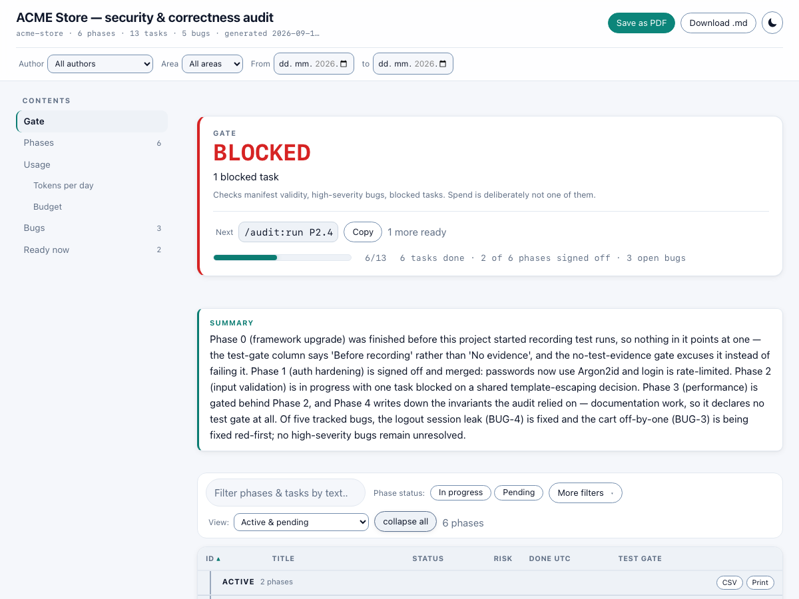](../../docs/screenshots/expanded.png) | [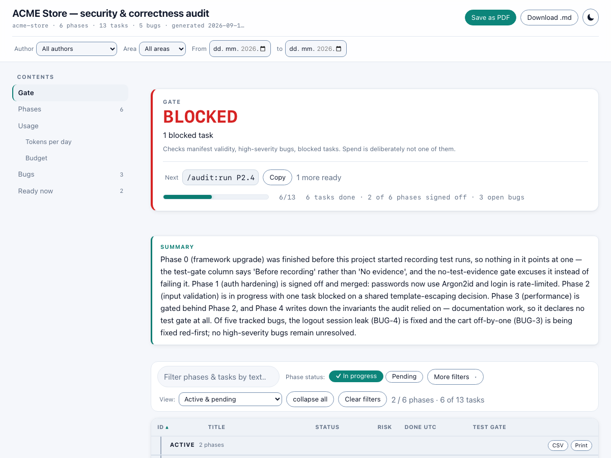](../../docs/screenshots/filtered.png) | [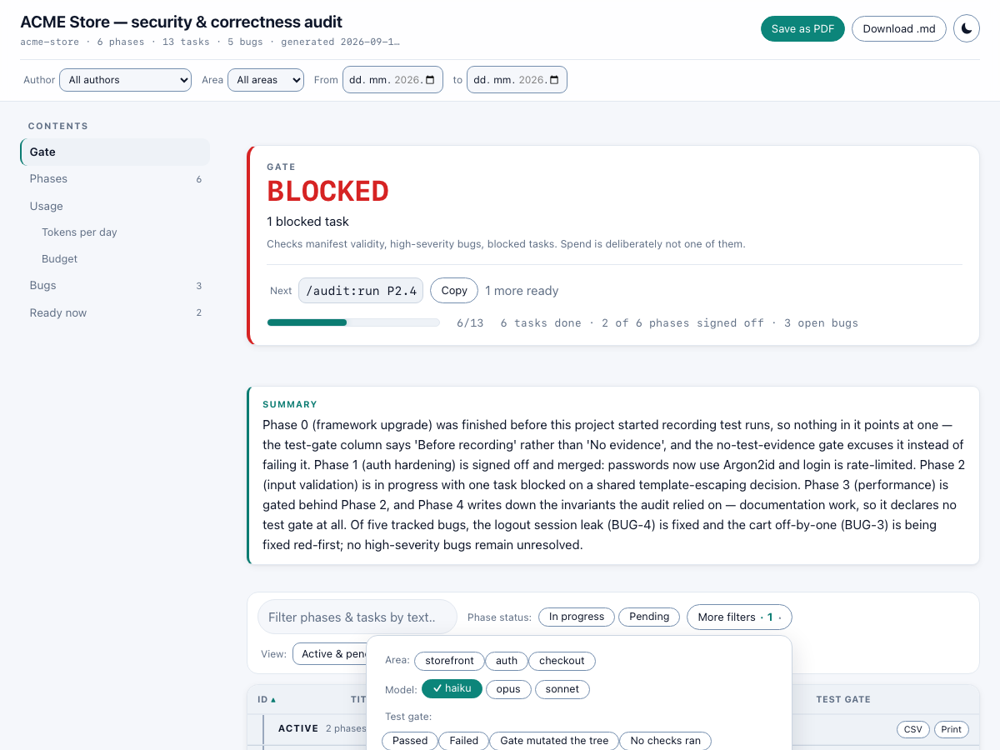](../../docs/screenshots/filters.png) | [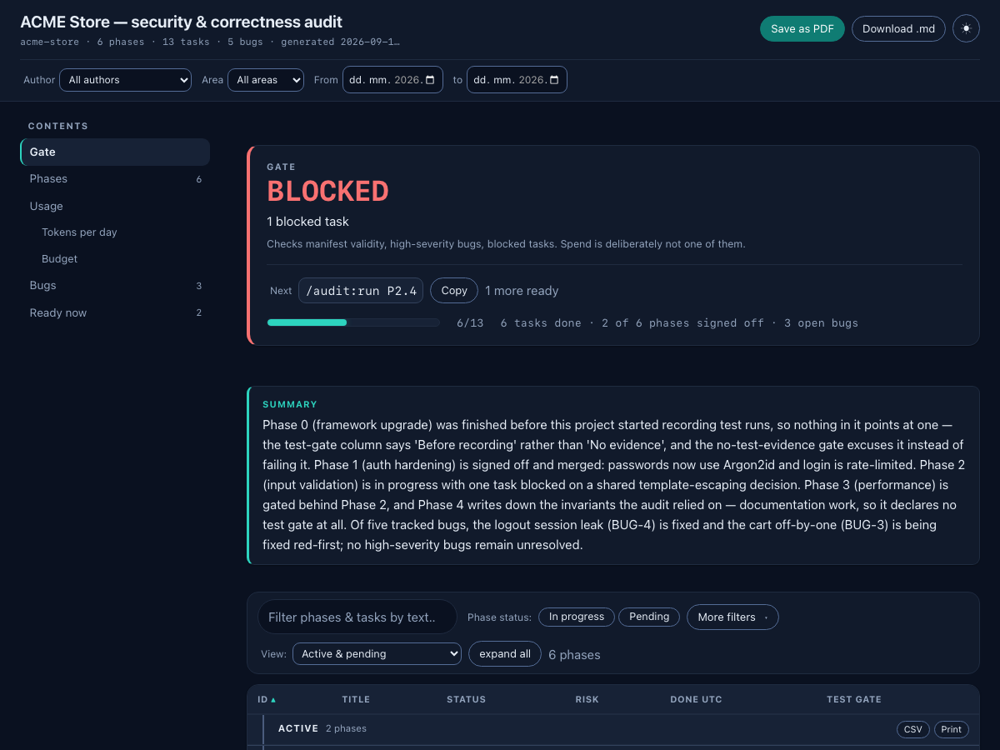](../../docs/screenshots/dark.png) |

Filters are the report's, not a viewer's: text, phase status, **area** tags, per-task **model**
and a **worked-between** date range whose 7/30-day presets count back from the last day the plan
recorded work — not from today, so a finished plan does not present three empty windows. A
filtered view is a link (the state rides in the `#!` fragment), a collapsed phase says how many
of its tasks matched, and nothing auto-expands. **Save as PDF** prints A4 in either orientation.

## Control panel

`/audit:panel` opens a local, **on-demand** browser UI (an ephemeral Python-stdlib server) to
manage the plugin without hand-editing JSON. It's an **open / stop / status** trio backed by a
per-project pidfile, so a running panel is always discoverable and stoppable — never a stray
background process:

- **`/audit:panel`** — open it (prints the `http://127.0.0.1:<port>/…` URL and opens your browser)
- **`/audit:panel stop`** — stop it · **`/audit:panel status`** — check if it's running
- In a terminal you can also run it in the foreground (`Ctrl-C` to stop); in a Node repo
  `npm run panel` / `npm run panel:stop` is the shortcut.

Its **Settings** tab is a form over the whole of `.claude/audit.config.json` — paths & gate,
write guards, TDD reminder, usage & pricing, audit trail — schema-validated, every field named by what it
does with its JSON key and an ⓘ hint beside it, and every field left empty simply absent from
the file. It also **wires composition** — `meta.reviewSkill`, per-task `skills`/`model`, per-phase review
model, `meta.buildCommands` — from **an autocomplete populated by the skills & agents actually
available** in this repo + `~/.claude/` + installed plugins. The model fields get the same
treatment with their **sources named**: models the manifest already uses, models the rate
table prices, and models **the token ledger has actually seen** — that last one is what a
typo'd manifest model looks like from the other side. Every autocomplete searches
descriptions as well as names, and a long result list says `…N more — keep typing` instead
of cutting off silently. Same Slate & Teal look, light/dark,
responsive. It writes only config + composition fields (never structural manifest CRUD, and never
while a `/audit` run holds the lock), validating before each atomic save. Composition is a
**compact, collapsible, filterable table** (search · phase-status · "needs skills" · expand-all)
that scales to hundreds of tasks — phases are collapsed by default; expand only what you touch.

Neither tab writes anything without showing you what: **Save opens a dialog listing every
change** (`P1.2 · model · sonnet → opus`) plus any phase running elsewhere right now, **Discard**
says how much work it would throw away, closing the tab with unsaved edits asks first, and the
server recomputes that list against the file it is about to write and sends it back — so a
manifest a second tab or an `/audit` run moved under you is reported rather than papered over.
The topbar names the identity a write is recorded under (`viewing as …`, resolved exactly as the
token ledger resolves a spender — see `usage.authorMode`), and Usage's **my spend** chip filters
on that same name. A save's outcome has a lifecycle to match its weight: a landed save says
**✓ saved** and dissolves five seconds later, while a refused save stays up — bold title, the
findings that refused it, its own dismiss × — until you close it or fix it; a refusal must
outlive a glance away.

The panel is also **live without being a distraction**: a fingerprint of the manifest, its
shards, the config and the ledger rides on the poll the panel already runs, so when the files
move on disk — an `/audit` run, a second tab, your editor — clean views re-render themselves
within a few seconds. A form holding **unsaved edits is left exactly as it is** and gets a
persistent notice instead: Save is still checked against the file as it is on disk (the confirm
dialog's echo), and Discard reloads what is really there. Refreshes hold while any dialog is
open.

| Settings | Composition (compact/collapsible) | Composition expanded | Save shows every change | Dark |
|---|---|---|---|---|
| [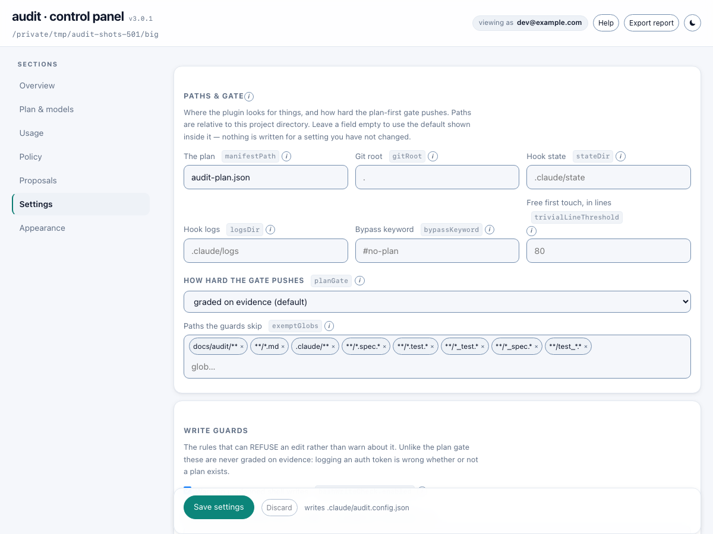](../../docs/screenshots/panel-guards.png) | [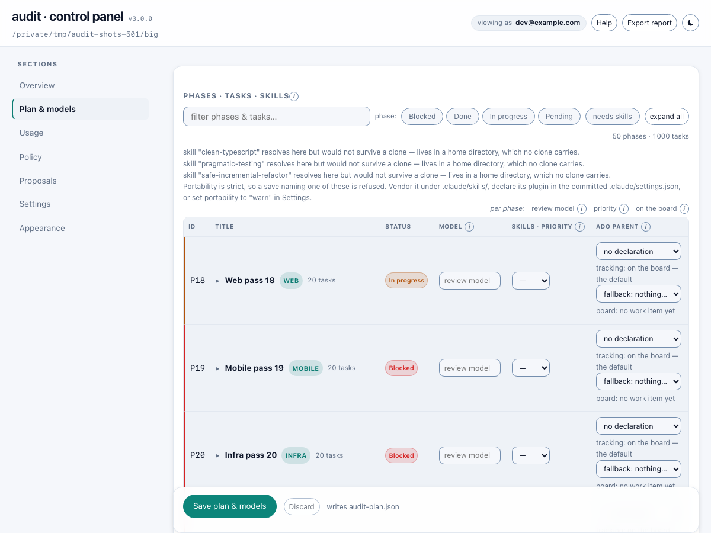](../../docs/screenshots/panel-composition.png) | [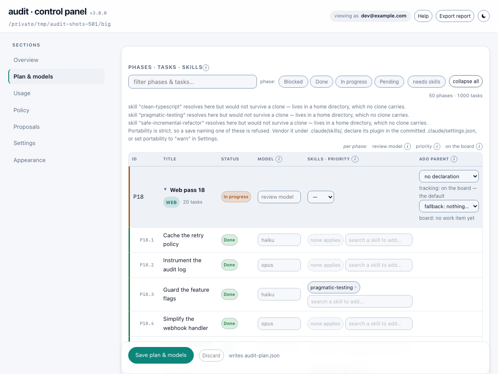](../../docs/screenshots/panel-composition-expanded.png) | [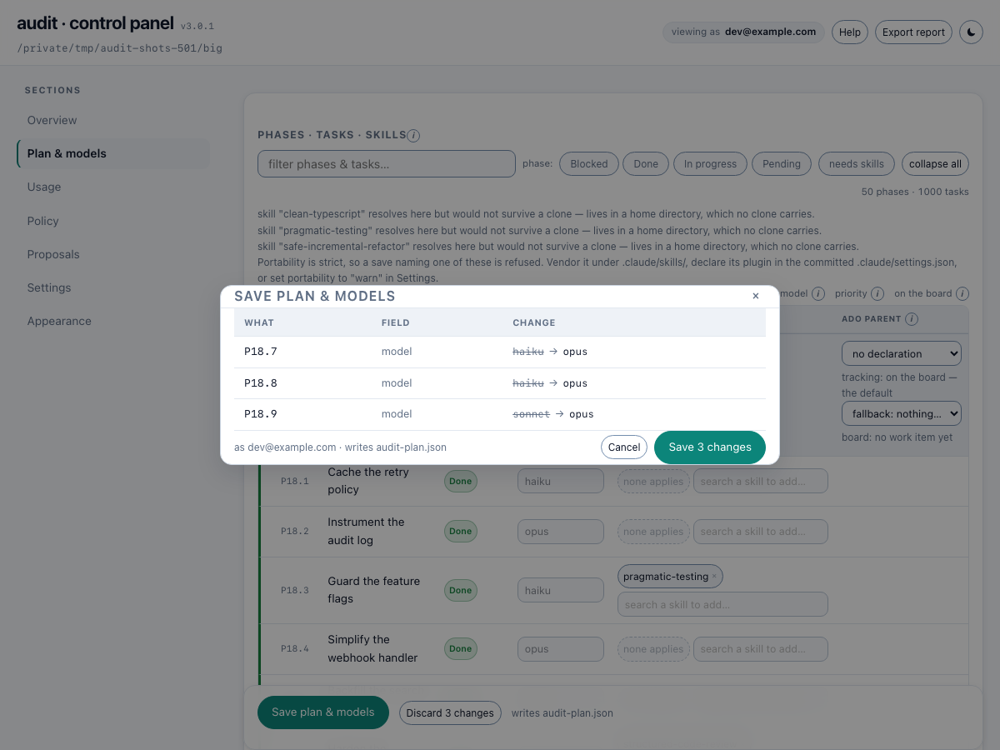](../../docs/screenshots/panel-confirm.png) | [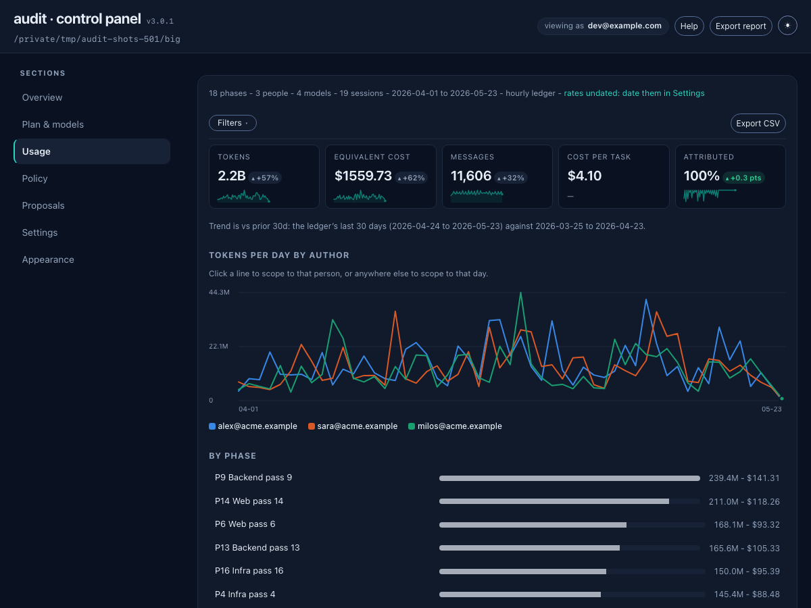](../../docs/screenshots/panel-dark.png) |

The **Overview** tab is a live validation + progress rollup you can steer by — status strips that
are both legend and filter, search, sort, group-by-area, each phase row carrying its desired
outcome and opening that phase in Composition, and a *Ready now* card with the `/audit:run <id>`
to copy — plus a **Plan gate** card: the tier in force, where it came from (`planGate`, legacy
`enforce`, or the graded ladder), whether a bypass is armed right now, and the latest
[gate events](#installing-arms-global-hooks) as they land — and the Composition tab lists the
**building blocks it discovered** (skills · agents · MCP servers, from this repo + `~/.claude/` +
installed plugins) — the names that feed the autocomplete. The **Usage** tab is the token ledger
with the filters on top of it (see [Token usage](#token-usage)) — and its filters **persist**:
the state rides in the URL fragment (`#/usage!au=…`), so a filtered view is a share link the
way the report's is, and it is remembered per repo across reopens; clearing the filters clears
both. All of it scales, and all of it
works on a phone — the shots below are a 50-phase × 1000-task manifest, and the last one is that
same panel at 390px:

| Overview (live rollup) | Discovered building blocks | Usage (filters, sparklines, CSV) | On a phone |
|---|---|---|---|
| [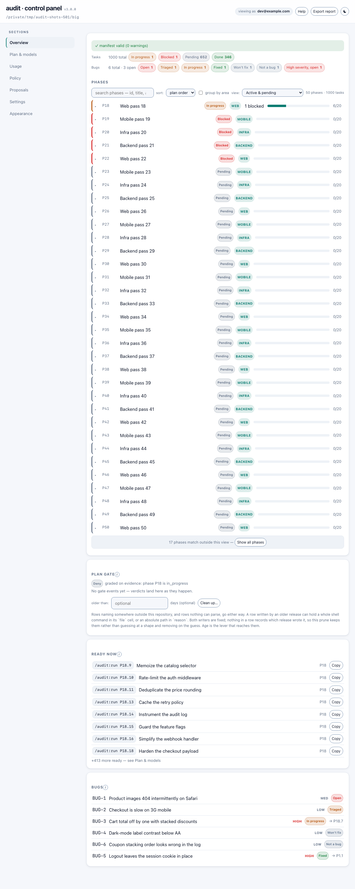](../../docs/screenshots/panel-overview.png) | [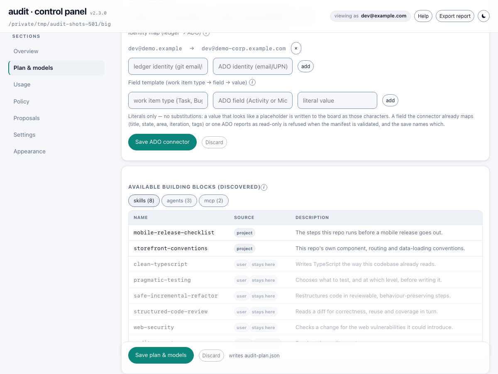](../../docs/screenshots/panel-blocks.png) | [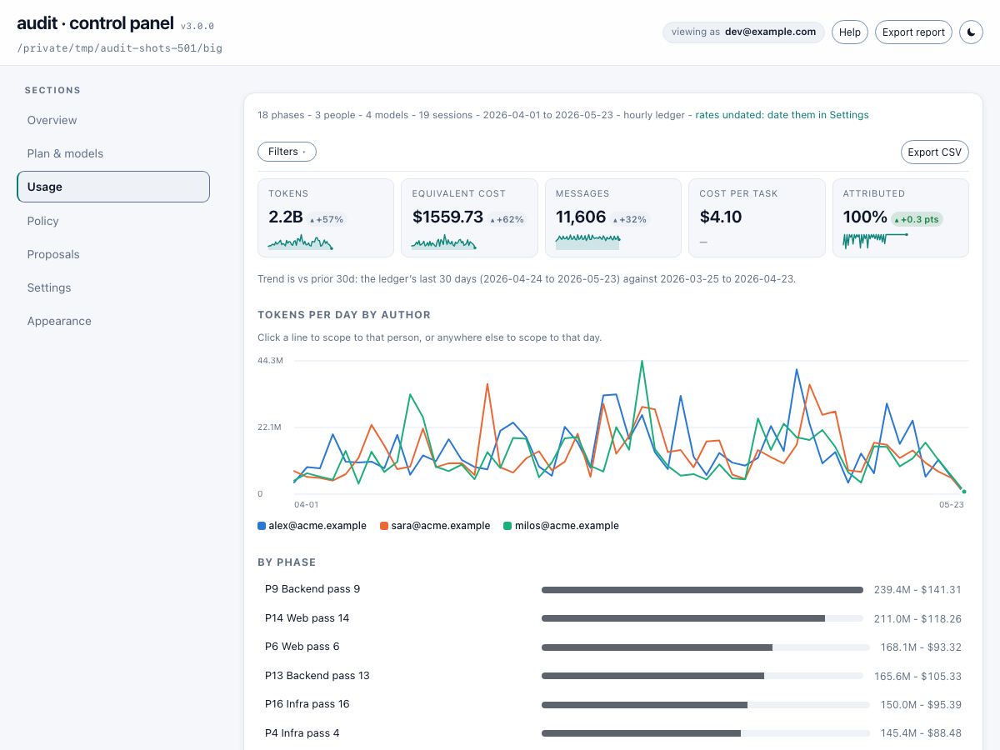](../../docs/screenshots/panel-usage.png) | [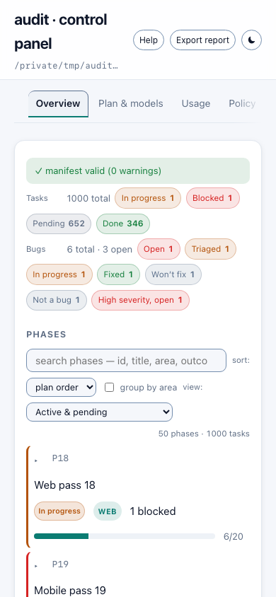](../../docs/screenshots/panel-mobile.png) |

The **Policy** tab is the switchboard over [the capability policy](#capability-policy--policy): one row
per skill, subagent and MCP server this project can reach, each carrying the verdict the guard
hook would give it *and the reason it gives it* — resolved by the same function the hook calls, so
the preview cannot disagree with the enforcement. Audit's own components are shown locked, because
the panel refuses to write a policy denying them; a column per area says which areas are **live**
(their rules apply) and which are dormant; and the line above the table says whether the policy is
inert, enforcing, or *active but never seen to run here* — which is what a Claude Code version
that does not dispatch these matchers looks like, and the one thing a page full of denials must
not paper over.

| Policy (verdicts, with the reason each one holds) |
|---|
| [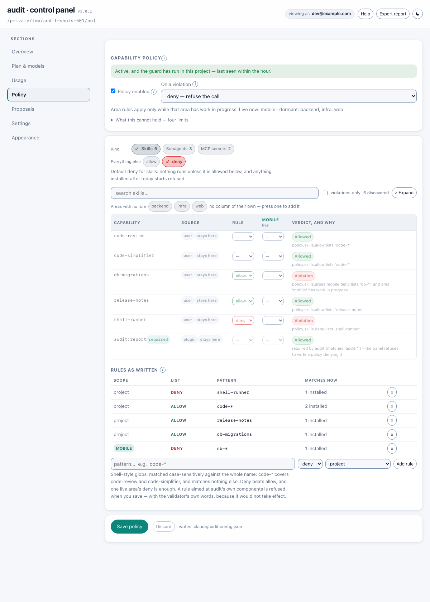](../../docs/screenshots/panel-policy.png) |

The **Appearance** tab edits the look — of the panel *and* of every report rendered afterwards,
because the two share one token layer. A theme is that layer as **data**: token values in a
[DTCG](https://www.designtokens.org/tr/drafts/format/)-shaped JSON file, compiled into the
stylesheet when a page is served. The CSS itself is never stored and never uploaded, and a theme
can set values and nothing else — no rule, no `url()`, no `@import` — because a report is a file
that gets emailed and published. Colours are edited in **light/dark pairs, side by side** (a
colour set in one theme only vanishes in the other, and the sheet's own parity lint refuses it),
the column you are currently viewing is marked *previewing* and repaints as you type — the panel
IS the preview — and contrast is measured and **warned** about, never refused: your theme, your
readers. The chart palette opens behind a deliberate unlock, since it is validated for
colour-vision deficiency against these very surfaces. There are three ways back, and they are
different things: **revert** one row, **undo** one step (the trail rides the file, so it survives
a reload), or **reset**, which removes the theme file rather than writing one that happens to
equal the default. Export hands over a `.json` to send someone (or a one-way `.css` to read);
import takes only the `.json`, validated token by token.

Beyond colours: **density** is one multiplier over the eight-step spacing scale (compact ·
comfortable · spacious — type follows at a third of it, because a compact panel wants tighter
air rather than smaller words), the **shell metrics** (`--nav-w`, `--shell-gap`) are ordinary
tokens, and each view's **card order** is a list you move with ↑↓ — a card the theme never
heard of keeps its place, so a theme written today cannot hide a card added later. Both are
previewed live, on the tab they are about.

Where it lives, first hit wins: `.claude/audit.theme.json` in the project (committed, so a team
shares one look through git) → `~/.claude/audit.theme.json` (yours, everywhere) → the built-in
Slate & Teal. `ui.theme` in the config overrides the search with a preset name or a path.
**Save as…** keeps the current look under a name in `.claude/themes/<name>.json` *and* wears it;
the **theme** menu lists the built-in plus everything saved there, and switching is a one-key
config edit that leaves every file where it is. The default theme is read *out of* the shipped
stylesheet and compiles back to it byte for byte — so installing this changes nothing on screen
until you change a token.

| Appearance (tokens, light and dark together, live) |
|---|
| [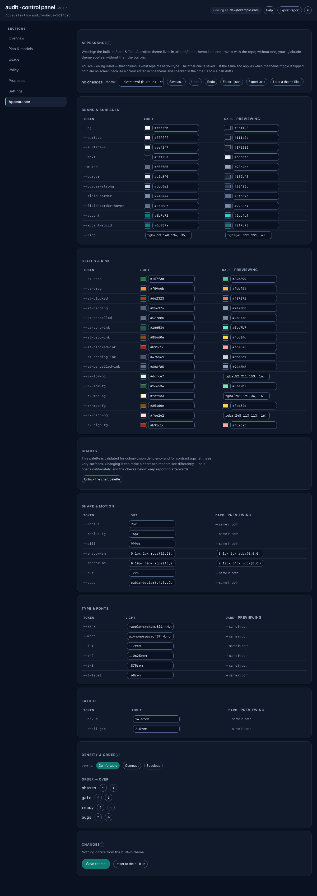](../../docs/screenshots/panel-appearance.png) |

Every ⓘ in the panel — and the **Help** button in the topbar — opens the **help drawer**: the
field's dotted path, what it accepts, the default the hooks really fall back to, and the concept
page behind it, read against the form rather than instead of it. All of it is
[served by the panel itself](#asking-it-how-it-works), and none of it costs a token.

| Help drawer (schema words, the real default, the page behind it) |
|---|
| [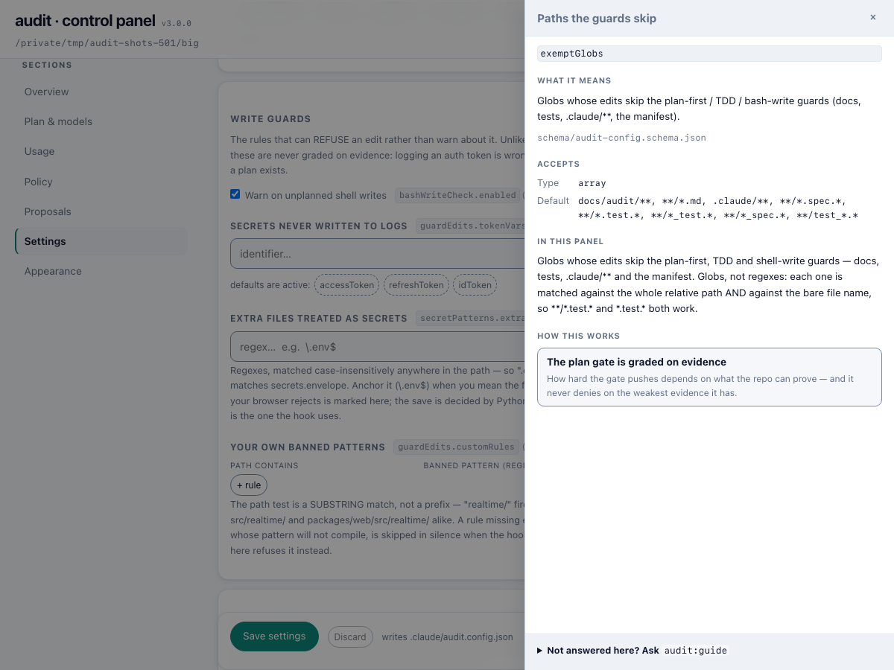](../../docs/screenshots/panel-help.png) |

## What you get

- **Execution commands** — `/audit:status` (report), `/audit:next` (next ready task),
  `/audit:run <id>` (one task), `/audit:phase <id>` (whole phase + sign-off),
  `/audit:review <id>` (re-run sign-off), `/audit:resume` (continue an interrupted run) —
  orchestrate phases → tasks from a JSON manifest. Per-task model + skills subagents,
  TDD/regression/gate-only test discipline, branch-per-phase git flow, gated phase sign-off
  (optional review skill + test gates + optional runtime boot). All share
  `reference/orchestrator.md`.
- **`/audit:init`** — multi-agent codebase audit that GENERATES the manifest: interview →
  recon → parallel read-only explorers → synthesized phases presented for **approval before
  anything is written** — approve to materialize, or park them as proposals.
- **`/audit:propose`** — the parked-phase lifecycle: `list` what init parked,
  `materialize` a proposal into a live phase (a move, not a re-synthesis), `drop` one
  with a recorded reason.
- **`/audit:task`** — add a tracked task: the command gathers answers (including a skills
  step fed by `audit-status --json --discovery`, with the explicit `null — none applies`
  choice) and calls `scripts/manifest/audit-task.py` for the write itself.
- **`/audit:bug`** — report/list/close bugs; `fix` materializes a bug into a **red-first TDD
  task** (the repro test must fail before the fix) executed by `/audit:run`.
- **`/audit:sync`** — mirror bugs/tasks into **Azure DevOps work items** (`push`), import
  assigned ADO bugs (`pull`), or diff link state (`status`). Explicit, idempotent, one
  direction per invocation; `az boards` CLI contract with the azure-devops MCP tools as an
  optional fast-path.
- **`/audit:report`** — self-contained, **interactive** HTML + Markdown report (collapsible
  phases, text + status filters, **Save as PDF**, optional AI summary) — publishable as a CI
  artifact, or to a link with `--share`. See [Reports](#reports).
- **`/audit:panel`** — a local **control panel** (browser UI) to visually manage the config +
  composition with live validation and skill/agent **discovery**. See [Control panel](#control-panel).
- **`/audit:doctor`** — answers "is this working?" before you find out the hard way: the interpreter the hooks will resolve, whether `gitRoot` is a repo, config and manifest validity, shard integrity, **which plan-gate tier is active**, submodule conflicts that would fail at commit time, whether the `buildCommands` runners exist, whether the hooks have ever fired here, the usage ledger, whether the audit trail still holds, and whether the capability policy is inert, contradicted by the plan, or never actually enforced. Read-only and safe mid-phase; exits 1 on findings so CI can run it too.
- **CI without Claude** — `scripts/status/audit-status.py --json | --gate` turns the manifest into
  a pipeline gate (fails on validator findings, open high-severity bugs, blocked tasks —
  tunable via `--fail-on`); see `docs/examples/azure-pipelines.yml`.
- **Pinned-tool agents** (`agents/`) — the orchestrator spawns the plugin's own subagents
  instead of free-form ones: `audit-explorer` is **mechanically read-only** (no Edit/Write/
  Bash in its tool list — not a prompt request, a hard boundary), `audit-executor` has no
  web tools and no nested agents, `audit-reviewer` can analyze but cannot edit. Commands
  fall back to general subagents on older Claude Code versions. A fourth, `guide`,
  is invoked by **you** rather than by the pipeline: it answers questions about the plugin
  from the plugin's own documents, with a citation per claim. See
  [Asking it how it works](#asking-it-how-it-works).
- **Hooks** (all launched via `py-launch.sh`, which resolves `python3` → `python` → `py`;
  the blocking guards fail **loud** — a manual-approval prompt — if no interpreter exists;
  every hook has a 10 s timeout):
  - `require-plan.py` (PreToolUse + PostToolUse: Edit/Write/MultiEdit/NotebookEdit) —
    non-trivial edits must be planned in the manifest or opted out via a single-use keyword,
    **once there is a plan to check against**: with no manifest it observes and reports once
    per session, with a manifest but nothing running it warns, and it denies only while a
    phase is `in_progress` (`planGate` pins any single tier — including `ask`, which holds
    each out-of-plan edit for your approval; legacy `enforce: true` = `planGate: "deny"`).
    The shell-write plan gate
    in `guard-secrets-read.py` grades identically, so `sed -i` and `Edit` agree on the same
    file; the secret checks themselves are never graded. A refusal names its true cause —
    the running phase by id, or the config key that pinned the tier — and weighs the two
    ways forward: add a task covering the file (preferred), or the **human** types the
    bypass keyword in their own prompt; an agent reading it is told to ask, not to
    recommend the bypass.
    "Non-trivial" = change magnitude (added lines, chars/200, or removed lines) over the
    threshold, or a second distinct file in a session. The bypass is **transactional**:
    observed before the edit, consumed only after it actually happens — and it expires
    unused after 30 minutes.
  - `detect-plan-skip.py` (UserPromptSubmit) — arms that single-use opt-out when **your**
    prompt contains the bypass keyword (and tells you, naming the 30-minute expiry; hooks
    see only human prompts, which is what makes the keyword the human's and not an
    agent's); also warns once per session when
    `.claude/audit.config.json` is malformed (your custom rules would silently not apply).
  - `guard-secrets-read.py` (PreToolUse: Read/Grep/Bash) — blocks reading secret files
    (`.env`, credentials, signing material) directly or indirectly (`git show`, `source`,
    `cp`/`mv`), dumping env/token values, and shell writes into source files
    (`sed -i`, `tee`, `>` redirects) that bypass the plan gate. Multi-clause commands are
    judged per clause (a redirect in one clause plus an eval in another is not an
    eval-write), and its verdicts land in the same gate events feed the panel reads.
  - `guard-edits.py` (PreToolUse: edits) — blocks token-logging, project-defined banned
    patterns, edits of the installed plugin's own files, and bypass-state forgery.
  - `guard-capabilities.py` (PreToolUse: Skill/Task/Agent/`mcp__*`) — enforces the
    project's **capability policy**: which skills, subagents and MCP tools may be used
    here, optionally scoped to the monorepo areas currently being worked on. Inert
    until a rule is written, and every refusal names the rule that produced it.
    `onViolation` chooses `deny` / `ask` / `warn`. See
    [Capability policy](#capability-policy--policy) — and its four honest limits in
    [SECURITY.md](../../SECURITY.md).
  - `guard-bash-writes.py` (PostToolUse: Bash + edits) — **non-blocking** git-status diff
    check: when a shell command modifies a source file that no tool edit and no
    `in_progress` task accounts for, the model is told — in-band — that it just sidestepped
    the plan gate (the statically-undecidable residual of the PreToolUse checks).
  - `remind-tdd.py` (PostToolUse: edits) — **non-blocking** nudge when source
    changes with no test touched in the session; throttled, manifest-aware, configurable.
  - `journal-writes.py` (PreToolUse + PostToolUse: edits) — appends one hash-chained
    row to the **audit trail** for every edit-tool write to the manifest or to
    `.claude/audit.config.json`: who, when, what, and the state it left behind. The
    Pre pass caches the file's pre-image so the Post pass can record a **field-level
    diff** (`P2.3: status in_progress->done, completedAt set`) and emit the
    **completion records** (`task.complete`, `task.commit`, `phase.signoff`) —
    hook-emitted only, never appended by hand. Silent, never blocking. It is a hook
    rather than an instruction because a model that forgets to log a change leaves a
    gap indistinguishable from one somebody hid. See [Audit trail](#audit-trail).
  - Stale session state (incl. forgotten armed bypasses) is garbage-collected after 7 days.
- **`schema/audit-plan.schema.json`** — a JSON Schema (draft 2020-12) for the manifest, so
  editors and CI validate it — plus `scripts/manifest/validate-manifest.py`, a dependency-free
  referential validator (unique ids, dependency **cycles**, reciprocal bug↔task links,
  bidirectional fileIndex, typo warnings; exit 0 valid / 1 findings / 2 unreadable) the
  commands run after every manifest mutation.
- **Audit trail** — `scripts/governance/audit-journal.py`: an append-only, hash-chained record of every
  write to the plan and to the config, `verify`-able from the CLI, from `/audit:doctor` and
  from CI. **Tamper-evident, not tamper-proof**, and it says so in every place it is
  described. See [Audit trail](#audit-trail).
- **`templates/`** — a config example and a starter manifest.
- **`skills/`** — two **thin** skills, `audit-codebase` and `audit-spend`. They exist so that
  "audit this codebase" and "what did that cost" reach the plugin at all: skills auto-trigger
  on what someone types, commands do not. They carry a routing table and name the command file
  to read — no procedure of their own, because two copies of a procedure is one copy and one
  lie. `audit-codebase` also says when **not** to use it: a one-shot look at the working diff
  belongs to `/review`, not to a manifest. See the decision record in `CONTRIBUTING.md`.

## Commands

Every action is its own `/audit:<verb>` (there is **no bare `/audit`**). Add `--dry-run` to
`next`/`run`/`phase` to preview without touching anything.

| Command | Arguments | What it does |
|---|---|---|
| `/audit:init` | `[scope/goals — you'll be interviewed for the rest]` | Multi-agent codebase audit that **generates** the manifest: interviews you for scope/dimensions/size, fans out parallel read-only explorers, synthesizes findings, then **presents the proposed phases for approval before writing** — approve to materialize, park everything as proposals, or choose per phase. The entry point every other command consumes. |
| `/audit:propose` | `list \| materialize <PROP-id>\|--all \| drop <PROP-id>` | Parked-phase lifecycle: `list` what `/audit:init` parked, `materialize` a proposal into a live phase (lossless — the full phase travels in the proposal's payload), `drop` one with a recorded reason. |
| `/audit:status` | — | Read-only rollup — phases, tasks, bugs, and the ready-now list, with per-phase progress and resumable-phase flags. No locks, no mutations. |
| `/audit:next` | `[--dry-run]` | Execute the next ready task (by phase order, then task id), then report what's ready next. `--dry-run` previews the choice without mutating. |
| `/audit:run` | `<taskId> [--dry-run]` | Execute exactly one task by id, with status guards (offers reopen if `done`, attempt-reset if `blocked`, warns if `in_progress`) and unmet-blocker checks. Reopening a bugfix task reopens its linked bug. |
| `/audit:phase` | `<phaseId> [--dry-run]` | Run a whole phase — execute every ready task (parallel where files are disjoint, sequential otherwise) until none remain, then phase sign-off (review skill + test gate + optional runtime boot + merge). |
| `/audit:review` | `<phaseId>` | Re-run **just** the phase sign-off for a phase whose tasks are already `done` — the recovery path after applying manual fixes. |
| `/audit:resume` | — | Continue an interrupted run: find the in-progress phase and resume from the first task whose commit is null. |
| `/audit:report` | `[--out-dir <dir>] [--share]` | Render a self-contained, interactive HTML + Markdown report (collapsible phases, filter/sort/search, Save-as-PDF, optional AI summary). `--share` publishes it as a Claude Code Artifact — a link a reviewer can open without installing anything — and asks before anything leaves the machine. Read-only; never mutates or locks the manifest. |
| `/audit:panel` | `[stop\|status] [--port <n>]` | Open / stop / check the local **control panel** (browser UI) to visually manage `.claude/audit.config.json` and the manifest's composition levers, with live validation and skill/agent discovery. See [Control panel](#control-panel). |
| `/audit:usage` | `[--by phase\|task\|model\|author\|agent\|day\|month] [--phase <id>] [--author <who>] [--area <tag>] [--since 7d] [--json] [--backfill]` | **Token spend, attributed** — per phase, task, model, author, area and time window (down to the calendar month), with cache economics, cost-per-task, a monthly overview and a usage trend. The script renders its own ASCII output (Claude prints it verbatim), so asking what you spent costs almost nothing. Read-only. |
| `/audit:migrate` | `[--dry-run] [--renumber] [--force]` | Convert the manifest to the **sharded layout** (index + one file per phase) — fewer tokens per phase, parallel-safe across worktrees. Opt-in, backed up, reversible; single-file manifests keep working without it. See [Sharded layout](#sharded-layout--parallel-phases). |
| `/audit:doctor` | `[--json]` | Diagnose the setup **before** it bites: which interpreter the hooks will resolve, whether `gitRoot` is a repo, config + manifest validity, shard integrity, **which plan-gate tier is active**, submodule conflicts that would fail at commit time, whether the `buildCommands` runners exist, whether the hooks have ever fired here, the usage ledger, whether the audit trail still holds, and whether the capability policy is inert, contradicted by the plan, or never actually enforced. Read-only; exits 1 on findings so CI can use it. |
| `/audit:worktree` | `<phaseId> [--remove]` | Create (or remove) a **git worktree** for a phase so you can run it in a parallel session — Claude does the `git worktree add` + derives the phase branch, then prints the `cd … && claude` line. Never edits the manifest. |
| `/audit:task` | `add "<title>" [--phase <id>] \| move <taskId> --to <phaseId> \| cancel <id> --reason "<why>"` | Add a tracked task — the command gathers answers (including a skills step with the explicit `null — none applies` choice) and calls `scripts/manifest/audit-task.py`, which allocates the id under the index lock, initializes every orchestrator field, updates the `fileIndex`, revalidates from disk (rolling back on findings) and journals a `task.add` row. The task is then executable via `/audit:run`. `cancel` closes a task — or a whole phase, cascading to the work still open inside it — as **terminal but not done**, recording the reason (into `outcome.descriptive` / the phase `summary`), the moment, and a `task.cancel`/`phase.cancel` journal row. A blank reason is refused: a status flipped with no why is the hand-edit the verb replaces. |
| `/audit:bug` | `add "<title>" \| list [all\|<status>] \| fix <bugId> [--phase <id>] \| close <bugId> [wontfix]` | Track bugs in the manifest's top-level `bugs[]`: `add` reports one, `list` shows the table, `fix` materializes a **red-first TDD** task in a `BF<n>` phase (repro test must fail on current code), `close` resolves it. |
| `/audit:sync` | `push [bugs\|tasks\|all] \| pull \| status` | Sync the manifest with Azure DevOps work items — `push` mirrors bugs/tasks outward, `pull` imports assigned ADO bugs, `status` shows a drift table. Explicit, idempotent, one direction per invocation; configured via `meta.ado`. |

**`/audit:panel` sub-commands** — bare `/audit:panel` opens it (prints the
`http://127.0.0.1:<port>/…` URL and opens your browser), `/audit:panel stop` stops it,
`/audit:panel status` reports whether one is running; `--port <n>` pins the port. One panel
per project, tracked by a `.claude/audit-panel.json` pidfile.

**Headless entry points** (no Claude, run in CI or any terminal): `scripts/status/audit-status.py
--json | --gate` turns the manifest into a pipeline gate, `scripts/report/render-report.py` renders
the report, and `scripts/manifest/validate-manifest.py` runs the referential validator (exit 0 valid /
1 findings / 2 unreadable).

## Requirements

- **Claude Code** (plugin support).
- **Python 3.8+** reachable on PATH as `python3`, `python`, or `py` (CI verifies on 3.12) — the hooks and the
  validator are dependency-free stdlib scripts.
- **POSIX `sh`** for the hook launcher. On **Windows** that means running Claude Code
  inside **Git Bash** (which also provides `sh`); with `cmd`/PowerShell-only sessions the
  hooks surface as non-blocking errors instead of running.
- Optional: Node/`npx` for JSON-Schema validation with `ajv-cli` (skipped when absent);
  the `az` CLI + `azure-devops` extension for `/audit:sync`.

## Install

```
/plugin marketplace add AleksandarBisevac/claude-plugins   # or a local path during dev
/plugin install audit@quality-gates
```

Commands appear as `/audit:status`, `/audit:doctor`, `/audit:next`, `/audit:run`, `/audit:phase`, `/audit:review`,
`/audit:resume`, `/audit:report`, `/audit:panel`, `/audit:init`, `/audit:propose`, `/audit:task`, `/audit:bug`, `/audit:sync` — every
action is its own `/audit:<verb>` (there is no bare `/audit`). If they don't show up immediately,
run `/reload-plugins` (or restart the session).

## Installing arms global hooks

The guard hooks activate in **every** project and session. That is the point — a guard you
have to remember to switch on is not a guard. But the plan gate is **enforced, once you
have a plan; observing before that**, so installing it does not start denying edits in
repos that never opted in.

**The plan gate grades itself on what it actually knows:**

| Your repo | Plan gate | What you see |
|---|---|---|
| No audit manifest | **observes** | One line per session naming what it *would* have held. Nothing is blocked. |
| A manifest, no phase `in_progress` | **warns** | An advisory noting the file is not covered by a running task. |
| A manifest + a phase `in_progress` | **denies** | Edits are held to the running plan (bypass: the **human** includes `#no-plan` in their own prompt — single-use, logged, expires unused after 30 minutes). |

The reasoning is the same one the cost report applies to itself: a claim needs the evidence
that makes it true. With no manifest there is no plan to check an edit against, so denying
there would be this plugin's strongest claim made on its weakest evidence. Grading it is
the thesis applied consistently, not a softening of it.

`planGate` in `.claude/audit.config.json` pins the gate to one tier by hand — `"observe"`,
`"warn"`, `"ask"` (every out-of-plan edit is held for your approval, one edit at a time) or
`"deny"` — as a decision you made, rather than a default that surprises a stranger. Unset,
the graded ladder above applies. It supersedes the legacy `enforce` key: `enforce: true`
means the same as `planGate: "deny"`, `planGate` wins when both are set, and a typo'd
`planGate` value falls back to the ladder — open, never to deny.

**Gate events.** Every verdict the plan gate reaches — a deny, a warn, an observe line, an
approved ask, a bypass armed / consumed / expired — leaves one JSON line in
`<logsDir>/plan-gate-events.jsonl` (it lives with the rest of `logsDir`, which ignores
itself — a `*` .gitignore inside; self-trimming past ~512KB; writing it never blocks anything). The panel's
Overview tab reads it: a **Plan gate** card naming the active tier and where it came from,
whether a bypass is armed right now, and the latest events — so what the gate has been
deciding on your behalf is a glance, not an archaeology dig. And when the gate warns instead
of denying, the warning opens with *"Tell the human this verbatim before continuing"* — the
agent reading it is asked to relay it, not to weigh it silently.

| The Plan gate card (tier, source, the latest verdicts) |
|---|
| [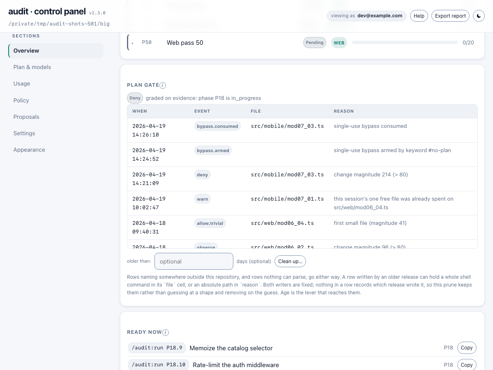](../../docs/screenshots/panel-gate.png) |

**Only the plan gate is graded.** The secret-read guard, the token-logging ban and the
shell-write secret checks deny by default at every tier: reading `.env` is wrong whether or
not a plan exists, so those guards need no evidence to be right. Docs (`**/*.md`), tests
(`**/*.spec.*`, `**/*.test.*`), `docs/audit/**` and `.claude/**` are always exempt — but a
test-suffix glob only claims CODE: `tsconfig.test.json` is a build config that happens to be
named like a test, and since 0.36 the matcher refuses to exempt a data/markup format
(.json/.yaml/.toml/...) on a test glob's say-so, in every guard at once.

Scope or turn it off:

- **Disable for one project:** `claude plugin disable audit@quality-gates` in that project
  (or `/plugin` → Installed → audit → Disable). Re-enable with `claude plugin enable`.
- **Soften instead of disabling:** raise `trivialLineThreshold`, extend `exemptGlobs`, or
  set `tddReminder.enabled: false` in that repo's `.claude/audit.config.json` (see
  Configuration below).
- **Uninstall completely:** `/plugin uninstall audit@quality-gates`.
- What each guard does with **no** config and **no** manifest: plan-first **observes**,
  secret-read guard (active — you want this one), token-logging ban (active),
  TDD reminder (active, non-blocking, throttled).

## Quick start

### First, the part that costs nothing

```
/audit:usage --backfill
```

No manifest, no agents, no tokens spent. It scans the Claude Code transcripts already
sitting in `~/.claude/projects/` and prints what this repo has cost you — totals, cache
economics, and a breakdown by model, author and **agent** (orchestrator vs. subagents),
with a daily trend. Nothing is generated and nothing is called; the data was already on
your disk, unread.

Every row will say **Uncategorized**, and that is the useful part. Native tooling can
tell you what a *session* or a *model* cost. Tying spend to a **phase and a task** needs
a plan to tie it to — which is what everything below builds, and the comparison a
date-range dashboard structurally cannot make.

Then check the setup is sound before committing to a run:

```
/audit:doctor          # interpreter the hooks will use, git root, config, manifest, gates
```

### Then the manifest

Generate it (recommended):

```
/audit:init            # interviews you, audits the codebase in parallel, proposes phases
                       # — approve to write them, or park them for /audit:propose later
```

…or copy the starter and fill it in by hand (from your repo root, any terminal):

```bash
mkdir -p docs/audit .claude
curl -fsSL https://raw.githubusercontent.com/AleksandarBisevac/claude-plugins/v0.39.0/plugins/audit/templates/audit-plan.starter.json -o docs/audit/audit-plan.json
curl -fsSL https://raw.githubusercontent.com/AleksandarBisevac/claude-plugins/v0.39.0/plugins/audit/templates/audit.config.example.json -o .claude/audit.config.json   # optional
```

> The starter's `meta.buildCommands` are **npm examples** — replace them with your repo's
> real lint/test/typecheck commands. Inside a Claude Code session the installed plugin's
> files are also reachable at `${CLAUDE_PLUGIN_ROOT}` (that's how the commands invoke the
> validator); `claude plugin list` shows what's installed.

Run it:

```
/audit:status          # report (phases, tasks, bugs, resumable phases), no changes
/audit:next            # execute the next ready task
/audit:phase P0        # run a whole phase, then sign it off
/audit:review P0       # re-run a phase's sign-off
/audit:resume          # continue an interrupted phase run
/audit:report          # write audit-report.html + .md next to the manifest
/audit:task add "..."  # add a tracked task (--phase <id> to target a phase)
```

## Bugs

```
/audit:bug add "Login crashes on empty email"   # report → BUG-1 (severity, repro, expected/actual)
/audit:bug list                                 # open/triaged/in_progress bugs (list all | list <status>)
/audit:bug fix BUG-1                            # materialize a tdd task in a BF<n> bugfix phase
/audit:run BF1.1                                # repro test red → fix → green → commit; bug flips to fixed
/audit:bug close BUG-2 wontfix                  # close with a justification
```

A bug is not a plan — bugs live in the manifest's top-level `bugs[]` until `fix`
materializes one into a task whose repro test **must fail on current code first**
(`tests.mode: "tdd"`, `expectRedFirst: true`). The orchestrator links them
(`bug.taskId ↔ task.bugId` — the validator enforces reciprocity) and flips the bug to
`fixed` + `fixedIn: <sha>` when the task commits.

## Configuration (`.claude/audit.config.json`)

Optional. Absent → safe defaults. **Present but malformed → defaults + a one-time
warning** (your custom patterns would otherwise silently not apply; the `/audit:*` commands also
refuse to run until it parses). Read by the hooks from `${CLAUDE_PROJECT_DIR}`.

| Key | Purpose | Default |
|---|---|---|
| `manifestPath` | Path to the manifest | `docs/audit/audit-plan.json` |
| `gitRoot` | Git repo root relative to the project dir (set when git/the workspace is in a subdir; keep in sync with manifest `meta.gitRoot`) | `.` |
| `exemptGlobs` | Globs exempt from plan-first (a test-suffix glob never claims a data/markup file — `tsconfig.test.json` is not a test) | `docs/audit/**`, `**/*.md`, `.claude/**`, `**/*.spec.*`, `**/*.test.*` |
| `planGate` | Pin the plan gate to one tier: `observe` \| `warn` \| `ask` (hold each out-of-plan edit for approval) \| `deny`. Unset → the graded ladder: observe → warn → deny (see above). Wins over `enforce`; an unknown value falls back to the ladder | unset |
| `enforce` | Legacy (pre-0.34): `true` = always-deny, the same as `planGate: "deny"` — which wins when both are set | `false` |
| `trivialLineThreshold` | Max change magnitude for the 1st free code file/session | `80` |
| `stateDir` / `logsDir` | Where state + bypass log live (both self-ignore — a `*` .gitignore is written inside; the journal is the opposite: never ignore it) | `.claude/state` / `.claude/logs` |
| `bypassKeyword` | Single-use plan-first opt-out keyword | `#no-plan` |
| `secretPatterns.extra` | Extra secret-path regexes (added to the built-in set) | `[]` |
| `guardEdits.tokenVars` | Identifier names treated as auth tokens | `accessToken`, `refreshToken`, `idToken` |
| `guardEdits.customRules` | Project banned patterns `{pathPrefix, bannedPattern, message}`. `pathPrefix` is matched as a **substring** of the path the edit tool reported (usually absolute) — `realtime/` covers every `realtime/` directory in the tree, not only one root | `[]` |
| `bashWriteCheck.enabled` | PostToolUse git-status diff check for shell writes into source (a session's first pass baselines pre-existing dirt silently — only NEW dirt is attributed) | `true` |
| `tddReminder.enabled` | Master switch for the non-blocking TDD nudge | `true` |
| `tddReminder.sourceGlobs` / `testGlobs` | What counts as source vs test files (source also feeds the shell-write guard) | common code (incl. `.ipynb`) / test patterns |
| `tddReminder.throttleMinutes` | Minimum gap between nudges | `10` |
| `tddReminder.inProgressPolicy` | Manifest interplay: `skip-gate-only` \| `skip-all` \| `warn-always` | `skip-gate-only` |
| `usage.enabled` | Meter token usage on Stop / SubagentStop | `true` |
| `usage.ledgerDir` | Where the monthly NDJSON ledger + scan cursors live (deliberately outside `stateDir`, which is GC'd) | `.claude/usage` |
| `usage.authorMode` | How the spender is recorded: `email` \| `name` \| `hash` \| `none` | `email` |
| `usage.showCost` | Show an equivalent API cost beside the tokens | `true` |
| `usage.backfillOnFirstRun` / `maxScanBytes` | On first sight of a transcript, read it from the start, up to this many bytes | `true` / `33554432` |
| `usage.currency` / `pricingAsOf` | Currency label, and the date the rate table was accurate (undated until you set it) | `USD` / the shipped table's date |
| `usage.bands` | `{highUSD, outlierUSD}` absolute cost bands; both unset → calibrate from this project's own completed tasks | both unset |
| `usage.pricing` | Model id → `{in, out, cacheW5m, cacheW1h, cacheR}` in currency per **million** tokens | shipped table |
| `journal.enabled` | Record every manifest / config write in the tamper-evident audit trail | `true` |
| `journal.dir` | Where the trail's monthly per-writer `.jsonl` files live; unset → beside the manifest, so one commit carries both the change and the record of it | unset |
| `journal.strictManifestState` | Opt-in confirmation prompt when an edit changes manifest **state** (a task/phase `status`, `completedAt`, `commit`, `attempts`): `off` \| `ask` — deliberately no `deny`, the orchestrator writes through the same tools | `off` |
| `policy.enabled` | Enforce the capability policy below | `true` (and inert — the shipped rules allow everything) |
| `policy.onViolation` | What a violation does: `deny` \| `ask` \| `warn` | `deny` |
| `policy.{skills,agents,mcp}` | Per kind: `{default: "allow"\|"deny", allow: [pattern], deny: [pattern], areas: {tag: {allow, deny}}}` | `default: "allow"`, no rules |

Every key above has a control in the panel's **Settings** tab, grouped into *Paths & gate*,
*Write guards*, *TDD reminder*, *Usage & pricing* and *Audit trail* — the coverage is asserted by
`panel-server.py --selftest` against `validate-config.py`'s own key sets, so a key documented
here and unreachable there is a build failure rather than a discovery. Two deliberate
exceptions, both pinned by that same selftest: `policy` is not a value with a box but a rule set
whose meaning is the verdict it produces for each installed capability, so it has its own
endpoint (`/api/policy`, which serves those verdicts) rather than a generic text field; and
legacy `enforce` has no checkbox because the `planGate` select **is** its control — the select's
preset reads the legacy flag, and choosing a tier writes `planGate` while deleting `enforce`,
one statement of the gate's tier instead of two contradicting ones.

### Capability policy — `policy`

Which **skills, subagents and MCP tools** may be used in this repository. Shipped inert: every
kind defaults to `allow` with no rules, which cannot refuse anything, so a repo that writes
nothing behaves exactly as it did before 0.30.0.

```json
"policy": {
  "onViolation": "deny",
  "agents": {"default": "deny", "allow": ["audit:*", "code-reviewer"]},
  "mcp":    {"deny": ["mcp__prod-db__*"]},
  "skills": {"areas": {"api": {"deny": ["deploy-*"]}}}
}
```

Patterns are case-sensitive globs against the name the call uses: the Skill tool's `skill`
(`dataviz`, `audit:next`), the Task/Agent tool's `subagent_type` (a call naming none is
`general-purpose`), or the **whole** MCP tool name — so `mcp__github__*` is how you name a server.

Resolution, in order — and every verdict prints the rule that produced it:

1. **audit's own** commands, skills and agents are allowed whatever the policy says.
2. **deny** wins over allow — project-wide, or from any area with work in progress.
3. **allow** — project-wide, or from any active area (several active areas *union* their allow
   lists: the more permissive answer, deliberately).
4. **default** for the kind.

A pattern that matches nothing installed here is a quiet no-op — usually a typo or a removed
tool. `/audit:doctor` warns about such **dead patterns** (against this machine's discovered
inventory, with the honest hedge that a teammate may have the tool), and the panel's Policy
tab marks them beside the rules as written. Advisory both places, never a refusal.

`areas` rules are scoped to a `meta.areas` tag and are in force **only while a phase carrying that
tag has work `in_progress`** — a hook sees a tool name, not a directory, so "in this area" can only
mean "while this area is being worked on".

`/audit:doctor` reports it: whether it is inert, whether the plan references a skill the policy
would refuse (which would otherwise surface at phase sign-off), and whether the guard has ever
actually run here. `/audit:panel` → **Policy** is the same thing as a form: every discovered
capability with its verdict and the reason for it, the block itself listed in resolution order,
and the four limits above one click away — see the [control panel](#control-panel).

**What it does not do** — stated in full in [SECURITY.md](../../SECURITY.md): it governs the tool,
not the knowledge; it holds only while the plugin is enabled; subagents do not inherit parent hooks
on every Claude Code version, so inside one it may be advisory; and hooks cannot gate hooks. The
plugin's own components are not deniable through its own policy — a rule aimed at them is reported
as a finding rather than silently ignored, because *not removable quietly* is a claim this can
keep and *unremovable* is not.

### The manifest's `meta` block

`meta` is the manifest's global configuration — it keeps everything project-specific out of the
commands. All fields are optional except `version`; the orchestrator resolves them at run time.

| `meta` field | What it's for | Default |
|---|---|---|
| `version` | Manifest schema version (**required**). | `2` |
| `repo` / `title` | Repo name + human title (title heads the report + browser tab). | — |
| `developmentBranch` | Branch phase branches fork from and merge back into. | `main` |
| `branchPrefix` | Prefix for per-phase branches → `audit/<phaseId>-<slug>`. | `audit` |
| `gitRoot` | Git repo root relative to the project dir (set when git lives in a subdir). | `.` |
| `reviewSkill` | Skill run at phase sign-off; `null` → tests are the signer. | `null` |
| `areas` | Registry of the areas a phase's `area` tag can name — `{tag: {root, description, reviewSkill?, skills?}}`. See below. | — |
| `runtimeBoot` | `{appRootPath, launch, verify}` smoke gate; `null` → skipped. | `null` |
| `nodePreamble` | Shell prefix run before build gates (e.g. `nvm use`). | `null` |
| `commit` | `{type, coauthor}` commit-message conventions. | `{chore, null}` |
| `buildCommands` | Map so gate entries like `test` resolve to a real command. | — |
| `ado` | Azure DevOps connector for `/audit:sync` + the orchestration echo — states, sprints, Remaining Work, comments; editable in the panel's ADO card (never store credentials). | `null` |
| `reportSummary` | Narrative shown in the report's **Summary** box (usually supplied read-only via `--summary-file`). | `null` |
| `reportBasename` | Custom report filename, e.g. `q3-audit` → `q3-audit.html/.md`. | `audit-report` |

Per-phase, `desiredOutcome` states what success looks like — `/audit:status` shows it, task
subagents receive it, and sign-off must address it.

### Monorepo areas — `meta.areas`

A phase's `area` tag groups it in status, report and panel. **Registering** that tag gives it
properties:

```json
"areas": {
  "api":    {"root": "services/api", "description": "Django service",
             "reviewSkill": "backend-review", "skills": ["python-conventions"]},
  "mobile": {"root": "apps/mobile",  "description": "Expo app"}
}
```

`root` is relative to the project dir, like `task.files`. `/audit:init` proposes a registry when it
detects a workspace (pnpm/yarn workspaces, turbo, nx, lerna, `go.work`, a Cargo workspace, a `.sln`)
and tags the phases it generates.

Three things resolve against it:

- **Review skill** — `phase.reviewSkill ?? meta.areas[tag].reviewSkill ?? meta.reviewSkill`. The
  first level that is **present** answers; an explicit `null` is an answer (skip review), not a
  fall-through.
- **Executor skills** — the area's `skills` first, then `task.skills`, deduped, area first.
  `task.skills: null` is the explicit opt-out — an answer, not a miss — and STOPS the area
  default; `[]` or absent means unconsidered, and the validator warns (never refuses) when a
  task resolves to zero skills without having answered.
- **Advisory owner** — `meta.areas[tag].owner`, written the way `usage.authorMode` records authors
  (git `user.email` under the default mode): who to coordinate with, never an assignee. Advisory
  only — when someone else edits a covered file in an owned area, the plan gate adds a
  once-per-session heads-up; `/audit:status` and the panel display it; nothing gates or assigns.

With several tags on one phase, **written order decides**. `/audit:status` prints the resolved
reviewer and where it came from (`review: backend-review (area api)`), and `/audit:doctor` warns
when a root is not a directory or a phase tag has no entry.

**Registration is optional in both directions and nothing is deprecated by it.** A free-text tag
with no entry stays legal — the validator warns only in a manifest that registers areas at all,
where an unregistered tag is nearly always a typo — and a registered area no phase uses is fine
too. A single-app repo writes none of this and behaves exactly as before.

**Areas filter every surface, through one read-time join.** A ledger row carries a `phaseId`, the
phase carries the tags, and nothing about an area is ever written into a row — so re-tagging a
phase re-attributes its whole ledger history on the next read, no backfill, because area is a
property of the plan, not of the moment the tokens were spent. On that one join: `/audit:status`
prints a `BY AREA` block (per tag: phases and done/total tasks, with an `untagged` footer);
`/audit:usage` takes `--area <tag>`, shows a `BY AREA` table in the dashboard and carries `byArea`
in `--json`; the report grows area chips that gate phases like the status chips do and travel in
the shareable hash as `a=`; and the panel's Usage tab gains an area select beside the other
filters. Two honest edges, stated wherever they apply: a phase tagged with several areas counts
under **each** of its tags, so area rows can sum past the total; and `untagged` is a real bucket —
phases with no tags, phases the plan does not know, and rows that never carried a phase.

| An area chip on: tagged phases stay, the rest — untagged included — are gone, and `a=` rides the hash |
|---|
| [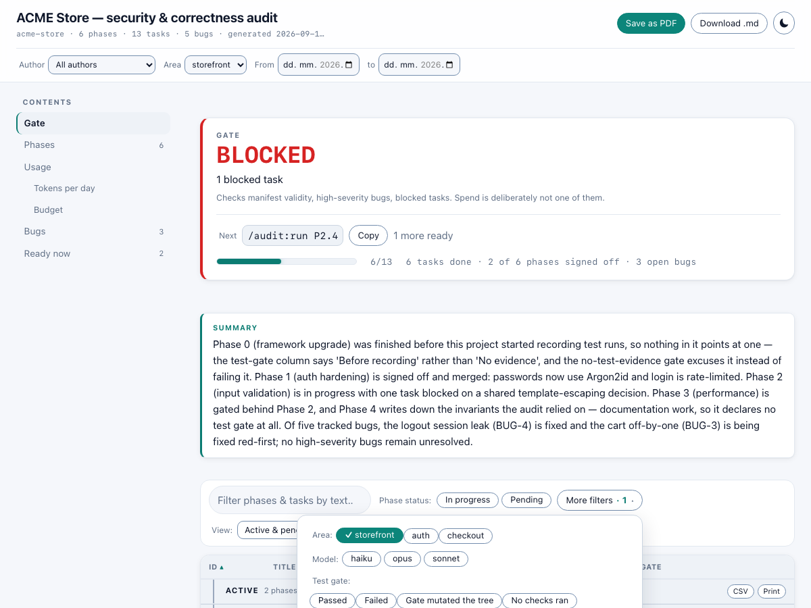](../../docs/screenshots/areas.png) |

## Reports

`/audit:report` renders the manifest to a shareable report — **one self-contained file, zero
network fetches, read-only** (it never mutates the manifest). Under the hood it runs:

```bash
python3 "${CLAUDE_PLUGIN_ROOT}/scripts/report/render-report.py" <manifestPath> \
  [--out-dir DIR] [--format html|md|both|artifact] [--summary-file PATH] [--basename NAME]
```

- **HTML** — collapsible phase rows (a 40-phase audit opens as ~40 lines, not one endless scroll),
  a phase text search + phase-status chips, a per-phase task-status filter, click-to-sort columns,
  a **Save as PDF** button (browser print, all phases expanded, either orientation), and a
  **Download .md** button.
  Every manifest value is HTML-escaped; the page fetches nothing.
- **Markdown** (`audit-report.md`) — renders inline on GitHub / in PRs.
- **Summary box** — pass `--summary-file` (a 2–4 sentence narrative) or set `meta.reportSummary`;
  `/audit:report` composes one for you. The quantitative "Overall" line is always present.
- **Filenames** — default `audit-report.html/.md`; override with `--basename` or `meta.reportBasename`.

### Sharing it as a link — `/audit:report --share`

A file on disk is shareable only by sending the file, and `file://` links do not travel. `--share`
publishes the same report as a **Claude Code Artifact**: a URL a reviewer opens in a browser,
having installed nothing.

It asks first, every time, and names what is in the page before publishing — phase and task
titles, `desiredOutcome` prose, the file paths under audit, commit hashes, open bugs, and the
spend when `usage.showCost` is on. A `--share` in the arguments is a request, not consent. The page
is private until you share it from its own menu.

Mechanically it is `--format artifact`, which writes `<basename>.artifact.html` beside the normal
outputs and never overwrites them. That file is the report without a document wrapper, because the
host supplies its own `<!doctype>`, `<head>` and `<body>` — publishing the standalone file would
nest a second document inside the first. It also withholds the report's own theme toggle, since
the host owns the theme there and stamps the same `data-theme` attribute; the report's stylesheet
already answers to it in both directions, so the viewer's choice wins.

Re-rendering an audit and publishing it to the **same** URL is the intended loop. A stale audit
link that still resolves is worse than no link at all.

See the [live demo](https://aleksandarbisevac.github.io/claude-plugins/) and the
[worked example](../../examples/). The same script runs headless in CI to publish the report as an
artifact (see `docs/examples/azure-pipelines.yml`).

## Token usage

The most common question testers ask is "what did that cost?" — so the plugin meters it.

**You can answer it before installing anything else.** `--backfill` reads the Claude Code
transcripts already in `~/.claude/projects/`, so it works in a repo with no manifest, no
config and no prior runs — nothing is generated and no agent is called:

```bash
/audit:usage --backfill               # free: past spend, from transcripts already on disk
```

Expect every row to read **Uncategorized**. Native tooling can price a *session* or a
*model*; attributing spend to a **phase and a task** requires a plan to attribute it to,
which is what the manifest is for. Once phases run:

```bash
/audit:usage                          # the dashboard
/audit:usage --by task --since 7d     # one focused table, last week
/audit:usage --by month               # spend by calendar month
/audit:usage --author sara@acme.io    # who spent what
/audit:usage --area api               # one area's spend ('untagged' works too)
/audit:usage --json                   # for CI (byMonth, byArea, monthly included)
```

```
USAGE  repo acme-store   window last 30d (2026-07-07 -> 2026-08-06)

  Total   122.2M tokens   ~$119.29 equiv   928 msgs   8 sessions   3 authors
          in 58.3K - out 1.2M - cache write 6.2M - cache read 114.7M   (cache hit 95%)

  BY PHASE                    tokens     cost   msgs  share
  P4   Report accessibility   29.8M    $27.87    198  [##########........]  24%
  P1   Manifest sharding      26.2M    $25.03    176  [#########.........]  21%
  Uncategorized             921.6K     $5.70     31  [..................]  <1%
```

**How the numbers are obtained.** Claude Code does not hand token counts to hooks, but it does
hand them a `transcript_path`, and the transcript records `usage` per assistant message. A
`Stop` / `SubagentStop` / `SessionEnd` hook tails that file from a saved byte offset and appends
to `.claude/usage/<YYYY-MM>.jsonl`. One trap is worth naming: a single `usage` block is repeated
across every transcript entry sharing its `message.id`, so anything that sums entries naively
over-reports spend by roughly 2.4x. The ledger dedups by message id, and a selftest pins it.

**Attribution**, most precise first — nothing is ever dropped:

| Level | How | Precision |
|---|---|---|
| task | each subagent has its own transcript, labelled with the task id | exact, even for parallel tasks |
| phase | the session that claimed the phase (`phase.claim.sessionId`) | orchestrator spend |
| window | exactly one task's `startedAt`/`completedAt` window contains the message | best-effort |
| unattributed | everything else — ad-hoc edits, `#no-plan`, pre-install sessions (shown as **Uncategorized**) | still counted |

A repo that has not run a phase since installing will show everything as **Uncategorized**. That is
the design, not a failure: off-pipeline work is exactly what you would otherwise never see.

**Month by month.** One function (`monthly_activity`) rolls the calendar up — ledger spend beside
plan progress: tasks by their `completedAt` month, bugs by `reportedAt`, fixes by the month their
linked task completed (the same derivation the bug list uses), phases by `mergedAt` — and three
surfaces render it, so their numbers cannot drift: a `MONTHLY` table in the CLI dashboard, a
Month-by-month table in the report's Usage section, and a clickable Monthly card in the panel that
scopes the view to the month you pick. All three appear only once the ledger spans two calendar
months — a one-month table would restate the totals — and all three state the same scope split:
ledger columns follow whatever filters are in force, plan columns count the **whole project** by
event month. `--by month` groups any focused table the same way, `--json` carries `byMonth` and
`monthly`, and the panel's chart adds a **last 12 months** preset plus a forced day/week/month bin
(calendar months, not 30-day windows).

| The panel's Monthly card — ledger columns that follow the filters, plan columns that count the whole project |
|---|
| [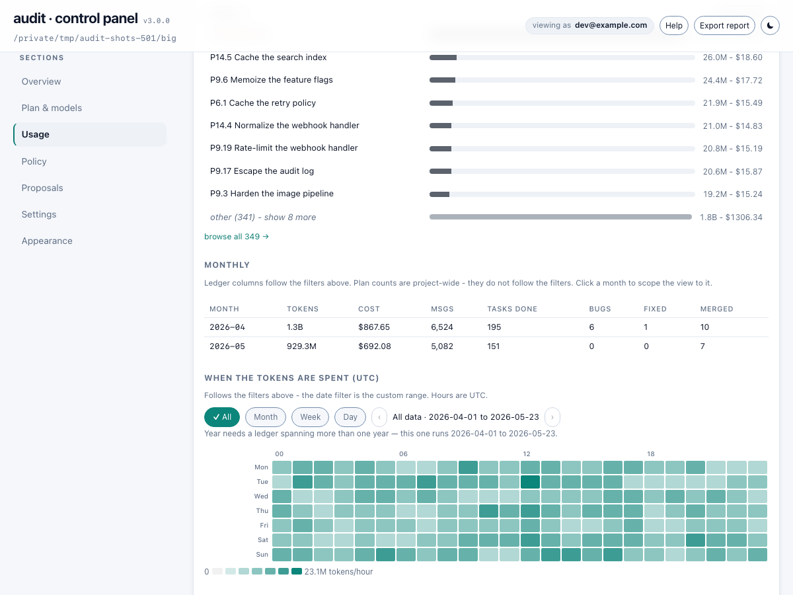](../../docs/screenshots/panel-monthly.png) |

**Cost bands.** Tasks are sorted into `typical` / `high` / `outlier` by what they cost, and the
threshold is the project's **own** median and p90 — so it means something on day one with no
configuration and re-calibrates as the work grows. Pin absolute numbers instead with
`usage.bands.highUSD` / `usage.bands.outlierUSD` when you have a real budget (the panel's
**Settings → Usage & pricing** edits the pair and checks it as you type); a malformed or
inverted pair falls back to the relative basis rather than banding anything wrongly. Below five
completed tasks nothing is banded at all — percentiles off three samples are noise, and a
confidently wrong band is worse than none. Every surface prints the thresholds it used, because
"this task is an outlier" is a claim and a claim whose basis is invisible cannot be checked.

Not to be confused with a task's `risk`, which is the risk of the *change* and is what model
routing compares within.

**One recommendation, heavily gated.** Where the ledger's own evidence supports moving work to a
cheaper model, all three surfaces say so:

```
WHAT THE EVIDENCE SUPPORTS
low work is running on claude-opus-5 - 7 task(s) at 1.0 mean attempts
  those same tokens cost $94.65 at claude-sonnet-5 rates vs $157.75  ->  $63.10 less (40%)
  claude-sonnet-5 has already run 5 task(s) in this band here, at 1.0 mean attempts
upper bound, not a forecast: the same tokens re-priced at the other model's rates
```

Every condition exists to stop this becoming the glib advice the routing table was built to
avoid. It compares **within one risk band** only, because hard work is routed to the strong model
on purpose. The cheaper model must already have run **at least three tasks in that band in this
repo** — otherwise "sonnet would be cheaper" is a price-list observation, not a finding. Its mean
attempts must be no worse, because a model that retries twice is not cheaper. Both models need
real rates in the table, never a `_default` guess. And the saving must clear both a percentage
and an absolute floor. On a well-routed project the output is silence, which is the correct
answer rather than a gap.

The figure is a **re-priced counterfactual, not a forecast**: the same token counts at the other
model's rates, both sides at today's prices so they share one rate epoch. A different model would
not emit the same tokens, so it is an upper bound.

**Per-phase budgets.** Put `budgetUSD` on a phase and the report and panel show spend against it:

```json
{ "id": "P1", "title": "Auth hardening", "budgetUSD": 40, "tasks": [ … ] }
```

```
Budget
P2 Input validation   ██████████  130%   $32.53 of $25.00 · over
P1 Auth hardening     ███████░░░   70%   $28.22 of $40.00
All budgeted phases                      $60.74 of $65.00
2 phase(s) have no budgetUSD set and are not listed — they are not phases at zero.
```

This ties spend to the **plan** rather than to the calendar, which is the comparison a
manifest-driven pipeline can make and a date-range dashboard cannot. It is optional and the block
renders only when at least one phase declares a budget. Phases without one are counted in a
footnote rather than drawn as a bar at 0% — an unbudgeted phase is not a phase at zero. The bar
caps at the track but the percentage does not, so an overrun reads as 130% rather than as a bar
that merely looks full. `budgetUSD` must be a positive number; `0`, a negative, a boolean or a
string is a validation finding, not a silent "no budget".

**A budget can gate, not just report.** Three surfaces read the same computed block, so they can
never disagree about what counts as over:

- **`/audit:status`** prints a line per budgeted phase, flagged `WARN` at 80% and `OVER` at 100%.
- **The pipeline**, with no Claude session involved:
  `audit-status.py <manifest> --gate --fail-on over-budget` (or `budget-80`) exits 1 and names the
  phase and both numbers — `P2 at 130% ($32.53 of $25.00)` — because "2 phases over budget" sends
  the reader hunting for which.
- **A run**, interactively: at 80% the orchestrator says so once per phase per session; at 100% it
  **asks before starting the next task** — continue, stop and resume later, or raise `budgetUSD` to
  a number you give it. It never raises the budget for you.

Neither budget condition is in the `--gate` default. Spend is a signal, not a defect: a phase at
105% may be entirely justified, and failing someone's merge over it unasked is how a gate becomes
something people switch off. Opt in when a budget is a commitment rather than an estimate.

The interactive gate is on **starting** work, never on finishing it — a task already mid-edit is
not interrupted for spend, because stopping there strands a half-finished change. And no budget
surface says anything when `usage.showCost` is false: naming dollars would leak exactly what that
setting exists to hide.

**One advisory, once.** When the task in flight passes `outlier`, the metering hook says so — in
the session, while there is still time to split or re-scope it:

```
[audit] P1.9 has cost $225.00, past this project's p90 completed task ($5.00).
        Consider splitting it or re-scoping before the next attempt.
        This is advice, not a gate — nothing is blocked.
```

It fires once per task per session (a warning that repeats every turn is a warning nobody reads)
and blocks nothing. A `Stop` hook could not block even if it wanted to — in that contract
`decision: "block"` means "do not stop, keep going" — and stopping a task mid-edit on spend would
strand a half-finished change, unlike a plan or test gate, which are recoverable.

**And one line at the end.** On `SessionEnd` the same hook says what the session cost, where the
work happened rather than only in a dashboard you have to remember to open:

```
[audit] this session: 250.2K tokens · ~$6.01 · 2 messages · 1 task(s): P1.9
```

A session that recorded nothing says nothing — reading code and asking questions should not
produce a row of zeros.

**Export from the panel.** `/audit:panel` has an **Export report** button that renders the
standalone HTML report and its Markdown twin, then opens it. The report already carries
Save-as-PDF via its print stylesheet, so there is no PDF machinery involved. It is served back
through the panel's own origin: a browser will not follow a `file://` link from an `http://`
page, so handing over a filesystem path would be a button that silently does nothing.

**Cost is labelled `equiv`.** It is computed from a price table in
`.claude/audit.config.json` (`usage.pricing`, USD per million tokens), not from a bill —
subscription plans carry no per-token charge. Keeping the table in config means a rate change is
a one-line edit in your repo, not a plugin release. Cost is priced and stored when a row is
written, so changing the table never rewrites history.

**Privacy.** Rows carry counts, model ids, timestamps, branch and author — never prompt content.
Transcripts are read-only. `usage.authorMode` accepts `email` (default), `name`, `hash`
(pseudonymous but still groupable) or `none`; `usage.enabled: false` turns the whole thing off.
The ledger ignores itself by default — every writer drops a `*` .gitignore inside the dir
(unlike the journal, which must be tracked). To share it across a team, `git add -f` the
monthly `*.jsonl` files once — tracked files are immune to the marker, while `.cursors`
stays local, which is what you want — and add
`*.jsonl merge=union` to `.gitattributes` (append-only NDJSON merges cleanly, and the per-row
author is what makes cross-developer analytics work).

**Who spent it, honestly scoped.** The ledger's per-row `author` is the only identity the plugin
records — tasks carry no assignee field — so the surfaces claim exactly what that join supports.
The report's Usage section grows **author chips** (only when the ledger records more than one
author, since a set of one has nothing to compare) that scope that section's per-author views and
nothing else — the tiles and trend above stay project-wide, the task table has no author to filter
by, and the page says so. The panel, where the author filter already is the drill-down, adds a
**person header** when one is selected: their all-time share of the spend, models used, phases and
tasks touched with a status split, and active range — all-time on purpose, because the tiles below
already answer the filtered question.

| Author chips in the report (one selected, the section scoped) | The panel's person header (all-time strip + status split) |
|---|---|
| [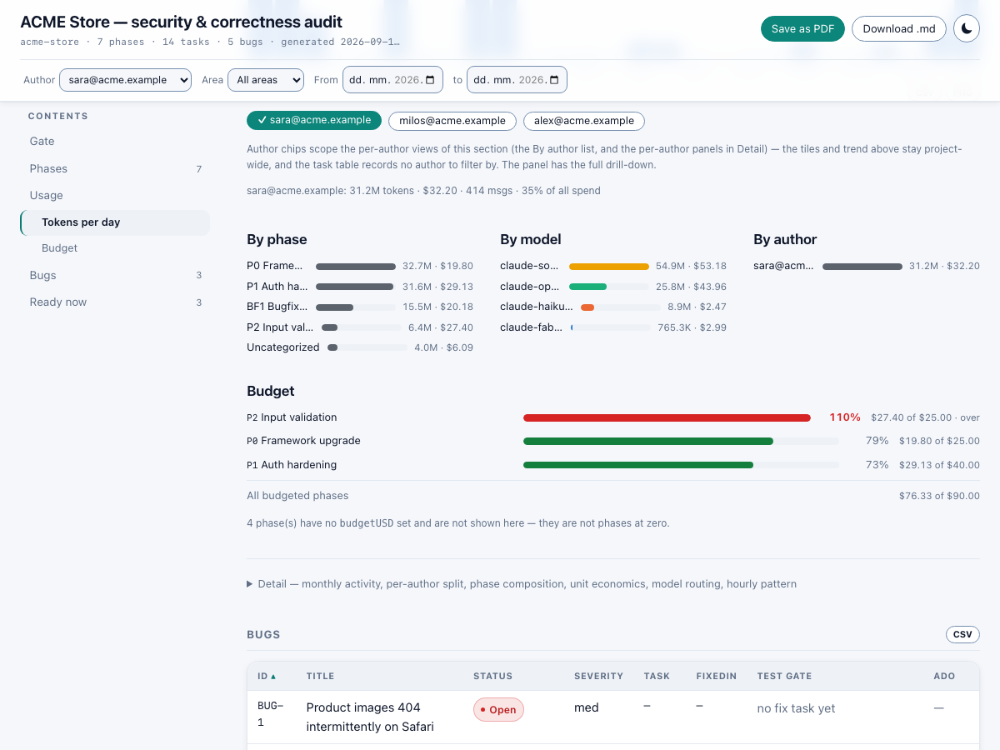](../../docs/screenshots/authors.png) | [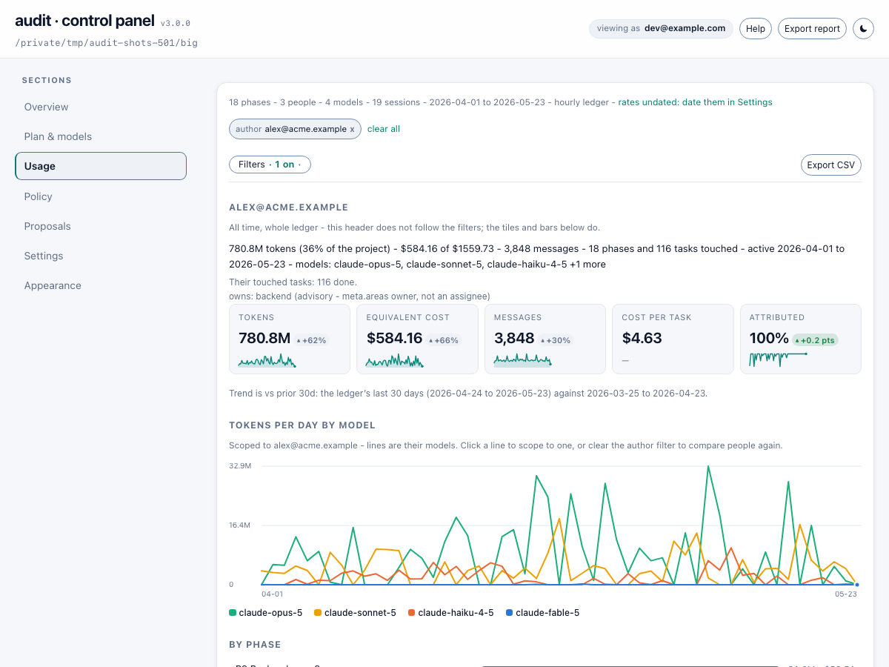](../../docs/screenshots/panel-person.png) |

The same data drives a **Usage section in `/audit:report`** (stat tiles, per-phase stacked bars by
model, a daily trend, a day x hour heatmap with **calendar navigation** — day/week/month/year,
arrows bounded by the data, the shown period always named — author chips and the month-by-month
table) and a **Usage tab in `/audit:panel`** with live
filtering by model, author, phase, task, agent, attribution, area, free text and an absolute date
window, sparklined KPI tiles with a trend against the previous period, **the same
calendar-navigated heatmap** driven by the persisted filters, and **Export CSV** of
exactly the rows behind the current view. The report adds a **global filter row** in its sticky
top bar (author, area, from/to date range — every choice a shareable `#` link that prints as a
named line), renders **Ready now as a definition list** (id, title, area chips, what cleared it),
splits long plans into **active / pending / archived segments** behind a named **View**
(active & pending, archived, all — the archive holds both terminal states, `done` and
`cancelled`) with per-segment **CSV export, chart PNG export (redrawn from data) and
print-to-PDF of one segment**, and shows each area's registered **owner** beside its tag —
advisory, the panel's own wording. Each task row **opens in place** for the parts a table
cannot hold: the full outcome, both timestamps, the whole commit sha (one press copies it),
the model, the work item and what the task waits on. A search that matches rows the current
view hides says so, and offers the one press that shows them; the view and every filter
survive a reload, including over `file://` where the URL fragment cannot be written.

## Audit trail

Who changed the plan, when, and to what. Every edit-tool write to the manifest (index or
phase shard) and to `.claude/audit.config.json` appends one row to an append-only,
hash-chained journal — the `journal-writes.py` hook records tool writes, panel saves record
their own, and each row carries the change, the person, the session, how the write arrived,
and a hash of the document it left behind.

```
docs/audit/journal/2026-08.<writerId>.jsonl        # one file per writer per month
{"v":1,"ts":"2026-08-10T09:12:44Z","actor":{"author":"dev@example.com","via":"panel",…},
 "action":"composition.write","target":"docs/audit/audit-plan.json",
 "summary":"1 change(s): P1.2 model: sonnet -> opus","stateHash":"sha256:…",
 "prev":"<the row before this one>","hash":"<this row>"}
```

```bash
python3 "${CLAUDE_PLUGIN_ROOT}/scripts/governance/audit-journal.py" verify   # 0 intact · 1 broken
python3 "${CLAUDE_PLUGIN_ROOT}/scripts/governance/audit-journal.py" show --limit 20
```

`verify` catches an **edited**, **deleted** or **reordered** row (the chain breaks at that
point), a file **renamed** into another writer's slot (the first row's `prev` is derived from
the file's own name), a **torn tail** from an interrupted write, **out-of-band drift** —
a manifest that moved with no row to explain it, which is what a shell write or a `git
checkout` looks like from here — and, once a journal file has been committed, a **rewritten
committed past**: `git show HEAD:<file>` must be a byte-prefix of the working copy, so the
"rewrite the whole file and recompute every hash" forgery stops verifying the moment the
journal is in git. `/audit:doctor` runs the same check; a broken chain and a changed
committed past are its only journal FINDINGs, because they are the only ones that cannot
happen by accident.

**Tamper-evident, not tamper-proof**, and the difference is the whole honest claim: absolute
immutability of local files does not exist — you own the disk, and with no secret key (there
is nowhere on your own machine to keep one you cannot read) a forger who rewrites every hash
forward produces a chain that verifies. The ceiling is tamper-evidence plus **three
cross-anchors** that have to be forged *consistently*:

1. the **hash-chained journal** itself, with its field-level diffs and completion records;
2. **git history** — the journal is staged into every task commit, so its committed past is
   pinned by every clone that has it;
3. the **usage ledger**, re-derivable at any time from Claude Code's own read-only
   transcripts (`/audit:usage --backfill`) and joined to tasks by `taskId`.

A forger must rewrite all three and keep them agreeing; any single-surface forgery — a
hand-flipped `done` with no `task.complete` row, a fabricated `task.commit` SHA git has
never seen, a rewritten journal whose committed past changed — is a `/audit:doctor` FINDING
(`check_completions` and the journal check). Deleting the file is the same class of act, and
is loud rather than silent. It is a smoke detector wired to three alarms, not a vault. See
[SECURITY.md](../../SECURITY.md#the-audit-trail-tamper-evident-not-tamper-proof).

The **completion records** are journal rows the `journal-writes` hook derives from the
manifest diff — `task.complete` (a task's status moved to done), `task.commit` (its commit
moved null → SHA), `phase.signoff` (a phase moved to done) — plus `task.move`, written by
`/audit:task move` when a task is renumbered into another phase. The hook is the only writer
of the first three; never append them by hand (two writers means duplicate rows). Tokens are
deliberately not in these rows — metering lands on Stop/SessionEnd, so any number written at
completion time would be wrong; the ledger is the anchor for spend.

The journal lives beside the manifest so the same commit carries the change and the record of
it (the orchestrator stages it with each task commit), and one file per writer means two
sessions in two worktrees never conflict on it. Do NOT add the journal directory to
`.gitignore` — git history is one of the trail's three anchors, and it can only pin what is
committed; an ignored journal quietly downgrades the trail from three anchors to two.
(`/audit:doctor` warns when journal files sit uncommitted for more than a week.) Edits to it
are refused by `guard-edits.py`;
a shell write into it cannot be refused, so `guard-bash-writes.py` reports it after the fact.
Turn it off with `journal.enabled: false` — the flip itself is journalled as a final
`config.edit` row (the last will), and `/audit:doctor` will say the trail was running and
has been turned off. For extra friction, `journal.strictManifestState: "ask"` surfaces a
confirmation prompt on any edit that changes manifest state.

**Growth.** The journal grows one file per writer (session) per month, and only for sessions
that actually write the manifest or the config — a solo developer sees roughly 20–60 files a
month in heavy use, a team of 3–4 perhaps 150+, each file a few KB of NDJSON. That is small
by design: the files are meant to be tracked, and git stores appends to them cheaply.
Verification cost is flat too — `verify` asks git about the whole directory once and pays the
per-file check only for files with uncommitted changes, so a year of history does not make
the doctor slower. There is deliberately **no compactor**: each file's chain is seeded from
its own basename and every row's hash covers its `prev`, so merging or rewriting old files
would be indistinguishable from the forgery the chain exists to catch. If a directory of
years-old files ever bothers you, retire them without touching a byte:
`audit-journal.py archive [--before YYYY-MM]` moves whole month-files into
`journal/archive/` with `git mv` — the chain seeds from the basename and survives only
untouched bytes, which is exactly what a move preserves — and `verify` and the doctor
follow them there (reported as `archive/<name>`). The current month never archives, and
an untracked file moves by plain rename (it has no committed history for git to carry).

## Azure DevOps (optional)

> The detailed field guide — setup walkthrough, every key with an example, recipes
> (Scrum, sprints, shared-sprint pull, identity mapping), the echo contract and
> troubleshooting — lives in [`docs/ado-connector.md`](../../docs/ado-connector.md).
> This section is the summary.

Add `meta.ado` to the manifest — or fill in the **ADO connector card** on the panel's
Composition tab, which edits the same block — and `/audit:sync` links the tracker to
your board:

```json
"ado": { "organization": "<org>", "project": "<project>",
         "areaPath": null, "iterationPath": null,
         "types": { "bug": "Bug", "task": "Task" },
         "identityMap": { "ana@corp.com": "ana.k@company.com" } }
```

That minimal block behaves as it always has. The connector v2 keys (all optional,
all editable in the panel card; contract in `reference/tracker-sync.md`):

| Key | What it does |
|---|---|
| `enabled` | master switch; `false` freezes push/pull/echo, keeps links, `status` still reports |
| `echo` | **absent = ON**: the orchestrator best-effort UPDATES already-linked items on task done/blocked/reopen and phase sign-off — state, Remaining Work, comments. Never creates items; `/audit:sync push` reconciles whatever it missed |
| `phaseWorkItems` | absent = ON: push creates one PBI per phase (`types.pbi`; null = auto-detect per process template, written back) and parent-links its items |
| `stateMap` | manifest status → ADO state per transition and kind (`task`/`bug`/`phase` — phase items carry a different vocabulary). A `null` value = never move that card. Defaults name **Agile** states — Scrum projects should set it (doctor carries the advisory) |
| `tag` | provenance tag on pushed/echoed items (default `audit-plugin`; `null` = none). Always merged into existing tags, never replacing; pairs with `pull.tags` for per-repo symmetry on shared sprints |
| `onComplete.remainingWork` | written on a task's done move (e.g. `0`); `null` = never touch the field |
| `comments` | opt-in generated comments: `onBlocked` (attempts + outcome + blockers), `onComplete` (sign-off note + commit) |
| `sprint` | `{ "team": "<team>" }` — resolve the team's CURRENT iteration at push time and stamp items into it; drift is reported and restamped after rollover |
| `pull` | sprint-pull scoping for shared sprints: `areaPath` and/or `tags` say which items belong to THIS repo; with neither, `pull sprint` refuses to import blind |

`identityMap` (optional) maps a **ledger identity** — the same form `usage.authorMode`
records authors and `meta.areas[*].owner` is written in — to that person's ADO email/UPN.
Advisory in every direction: `push` **proposes** `--assigned-to` for a create whose area
owner is mapped (one batched question per person; never silently, never on updates), `pull`
reverse-maps a known assignee into `reportedBy`'s ledger form (existing rows are never
rewritten), `status` shows mapped/unmapped coverage. The validator checks shape only and
warns on duplicate values.

- `/audit:sync push [bugs|tasks|all] [--task <id> | --phase <id>]` — create/update work
  items (PBIs per phase when `phaseWorkItems`); shows the plan and asks before the first
  write; write-back `ado: {id, url, lastSyncedAt}` per item makes re-runs converge.
- `/audit:sync pull [bugs|sprint]` — import unlinked ADO bugs, or the current sprint's
  PBIs/tasks as **parked proposals** (`/audit:propose materialize` moves them into the
  live plan; a re-pull imports nothing).
- `/audit:sync status` — read-only drift table (manifest state vs ADO state, sprint
  drift, enabled/echo line).

Cards move via `System.State` only — a board column not backed by a state is reported
as unreachable, never faked. Link creation is journaled (`ado.link`); `lastSyncedAt`
bumps deliberately are not. Auth belongs to `az login` (locally) or the
`AZURE_DEVOPS_EXT_PAT` variable (CI) — the plugin never stores or prints credentials.
For pipelines, `docs/examples/azure-pipelines.yml` shows the validate → gate → report flow.

## Git repo in a subdirectory (monorepo / workspace)

The orchestrator runs **git** commands in the git root (`git -C <gitRoot>`) and stages task files with
the `gitRoot` prefix stripped; **build/gate commands run from the project dir** exactly as the manifest
gives them (so a subdir gate reads `cd test && npx nx …`). If your git repo (or Nx/Turborepo workspace)
lives in a subdirectory of where you open Claude Code — so the project dir is NOT itself a git repo —
set the git root in both places:

```jsonc
// manifest meta
"gitRoot": "test"
// .claude/audit.config.json
"gitRoot": "test"
```

`/audit:init` detects this and sets `meta.gitRoot` for you (older 0.2.0 manifests used `meta.workspaceRoot`,
which the orchestrator still reads as a fallback). Task `files` stay project-dir-relative (e.g. `test/src/foo.ts`);
the orchestrator strips the prefix when staging. The `/audit:*` commands **preflight** this: if the resolved git root
isn't a git repo they stop with guidance instead of failing mid-run. Prefer keeping the manifest **inside**
the git root (e.g. `test/docs/audit/audit-plan.json`) so its status history can be committed.

## Asking it how it works

Two answers, and the cheap one comes first.

**The panel serves its own field documentation.** `GET /api/help` returns every dotted config
and manifest path with the description the **schema** gives it — extracted at request time from
`schema/audit-config.schema.json` and `schema/audit-plan.schema.json`, never re-typed, so what
the panel tells you and what your editor validates against cannot drift apart. Alongside the
fields it carries four concept pages — how the plan gate grades itself, how an area resolves a
reviewer, how a capability policy reaches a verdict, what the journal can and cannot prove — and
each of those derives its rule from the code that executes it (the tier table is
`_config.plan_gate_mode`'s own answers; the policy page is a worked example run through the
guard's resolver). It costs nothing to ask and nothing to answer.

In the panel that is the **ⓘ beside every field** and the **Help** button in the topbar; the
drawer opens beside the form so the control and its explanation are on screen together, and a
field that belongs to one of the four pages offers it. A path into your own document
(`usage.pricing.claude-opus-4-1.in`) is resolved onto the shape that documents it
(`usage.pricing.<name>.in`) **by the server** — the browser is handed an answer rather than the
machinery to compute one, so a second matcher cannot drift into disagreeing with the first.

**`audit:guide` is the conversational half.** A subagent (`Read`/`Grep`/`Glob`, `model: haiku`)
that answers questions about this plugin from this plugin's documents — README, `reference/`,
the schemas, `commands/*.md`, and [SECURITY.md](../../SECURITY.md) — with a file-and-line
citation for every claim, and "the documents do not say" when they do not. Ask for it by name:

> Use the audit:guide subagent: what does `planGate: "ask"` change, and what stays graded?

It is **mechanically read-only** — no Edit, no Write, no Bash — so it explains the command to
run and never claims to have run it. And it is deliberately **not** a skill: a skill
auto-triggers, which would quietly bill a model for questions the panel already answers for
free. You choose when it is worth a model.

## Troubleshooting

- **An `/audit:*` command stops with "git root is not a git repository".** Your git repo is in a
  subdir — set `gitRoot` (see above). This is the preflight doing its job.
- **A permission prompt keeps reappearing after `/plugin update`.** Claude Code may have captured an
  allow-rule pinned to the old version's cache path (e.g. `…/audit/0.2.0/scripts/…`). After an update
  the path becomes `…/0.6.1/…`; remove the stale pinned entry from `.claude/settings.local.json` (the
  commands invoke scripts via `${CLAUDE_PLUGIN_ROOT}`, which tracks the current version automatically).
- **Guards don't fire at all.** Ensure Python is reachable (`python3`, `python`, or `py`) and, on
  Windows, that you're in Git Bash (see Requirements). A missing interpreter makes the blocking guards
  prompt for manual approval rather than silently passing.
- **`.claude/state` / `.claude/logs` showing up as untracked.** Any hook run makes them
  self-ignore (a `*` .gitignore inside; `/audit:doctor`'s hygiene check verifies it); the plugin
  garbage-collects entries older than 7 days but never commits them.
- **Journal files showing up as untracked.** The opposite case: untracked journal files are work
  not yet committed, not clutter — stage and commit them (the orchestrator does this with each
  task commit). Never add the journal directory to `.gitignore`; the git anchor only pins
  committed history.
- **Git submodules.** The orchestrator commits from one repo (the git root); files inside a
  submodule belong to a separate nested repo the parent can't stage. The `/audit:*` commands preflight
  this — if a `task.files` entry is inside a submodule they **stop** and tell you to either point `meta.gitRoot` at
  that submodule (to audit it directly) or drop those files from the task. Plan-first / secret guards
  still apply to submodule paths by path; only the per-task commit and the PostToolUse shell-write
  check are submodule-boundary limited.

## Repos without tests

"Test-driven" needs tests to drive. In a repo with **no test runner**, gate entries are
empty and `testGateGreen` passes **vacuously** — the discipline silently does nothing.
Do one of: set a real `meta.buildCommands.test` (add a runner first — even one smoke test),
or put explicit `"manual: <checklist>"` entries in `phase.testGate` so sign-off surfaces
human action items instead of green-lighting nothing. `/audit:init` detects your build
commands and will tell you when it finds none.

## Concurrency & the sharded layout

<a id="sharded-layout--parallel-phases"></a>
Mutating subcommands hold a lock in the **shared git dir**
(`$(git rev-parse --git-common-dir)/audit-locks/`), **two-tier**: a brief **index lock**
(structural writes + id allocation) and a per-phase **shard lock** (a phase run). Taking, judging
and releasing a lock is `scripts/governance/audit-lock.py`, not prose — a lock held by a **live** run refuses
a second session with the holder's info, and one whose holder is **gone** offers a confirmed
takeover. It decides which by probing the holder's pid on this host rather than by the lock's age:
a healthy 90-minute phase run is not a crashed one, and a run that died after ten minutes should
not hold its lock for another fifty. Age remains the fallback when liveness is unknowable — no pid
recorded, or a lock from another machine. `status` and `report` never lock. Because the lock lives inside `.git/`, it
never shows up in `git status` and needs no `.gitignore` entry. (No git repo → it falls back to
`<manifestPath>.lock` in the working tree, which coordinates within a single clone only.)

**Sharded layout — parallel phases.** Run **`/audit:migrate`** to split the manifest into an
*index* (`meta` · `bugs` · `fileIndex`) plus one file per phase (`phases/<phaseId>.json`). Then a
phase command loads **only its own phase** (fewer tokens at scale), and because two phase branches
edit different shard files — and a run never writes the shared index (bug status is **derived** from
the linked task) — **two phases run in parallel from separate git worktrees and merge back with no
manifest conflict.** Ids are allocated under the index lock, so they never collide. It's opt-in and
fully reversible; single-file manifests keep working exactly as before (one session per clone). To
run two phases at once:

Use **`/audit:worktree <phaseId>`** — Claude runs `git worktree add`, derives the phase branch, and
prints the `cd … && claude` line for you:

```
/audit:worktree P2      # → ../<repo>-P2 on branch audit/p2-…; open a session there, run /audit:phase P2
/audit:worktree P3      # → a second worktree for P3, in parallel
# …then merge both branches into develop — the shards don't conflict — and /audit:worktree P2 --remove.
```
(Or do it by hand: `git worktree add ../audit-P2 -b audit/p2 develop`, one Claude session per worktree.)

## Extending (three layers, no plugin editing)

An installed plugin is read-only (a `/plugin update` overwrites in-place edits — and since
0.3.0 `guard-edits` blocks runtime self-edits too), so extend it via:

1. **Configure** — `.claude/audit.config.json` + manifest `meta.*`. Covers most per-project needs
   (globs, thresholds, branch, custom guard rules, token names, review skill, boot gate).
2. **Extend additively** — your repo's own `.claude/skills/`, `.claude/hooks/`, `.claude/agents/`
   compose with the plugin's. Add project skills/hooks without touching the plugin. (e.g. a project
   review skill stays in your repo; set `meta.reviewSkill` to its name and sign-off calls it.)
3. **Fork** — for deep changes, fork this repo or disable a plugin hook and ship your own. Rarely
   needed because the hooks are config-driven.

## The manifest in one minute

`meta` (global config) · `phases[]` (each with `tasks[]`, a `desiredOutcome`, a `testGate`) ·
`fileIndex` (file → task ids, validated bidirectionally) · `bugs[]` (tracker; outside phases
until materialized) · `deferred` · `proposals[]` (parked phases — full phase payloads that
`/audit:init` wrote but the user has not approved yet; `/audit:propose` materializes or drops
them, and their ids stay reserved while parked). A task carries `model`, `skills`,
`blockedBy`/`dependsOn` (cycle-checked), `files`, `tests` (`mode` + `add` + `gate`), `risk`,
optional `bugId`, and orchestrator-written `status`/`commit`/`outcome`.

A phase or task is `pending`, `in_progress`, `blocked`, `done` or **`cancelled`**. The last
two are TERMINAL and the report files both under **Archived**: `done` is the work landed,
`cancelled` is the work will not be done — the feature was dropped, the approach abandoned,
the phase closes with whatever landed. It is the phase/task twin of a bug's `wontfix`, and
nothing is deleted to express it (the history, the commits and the outcome stay). Readiness
treats a cancelled blocker as settled, so a plan never deadlocks on work nobody will do, and
a task that was waiting on one becomes ready — worth a look before it runs. Set it with
`/audit:task cancel <id> --reason "<why>"`, which records the reason, the moment and a
journal row, and cascades to the work still open inside a cancelled phase; `/audit:sync`
maps it to the tracker's own word (`Removed` on Azure DevOps).

A phase runs on an
`audit/<id>-<slug>` branch, commits per task, and merges into `meta.developmentBranch` after
sign-off (ff, or `--no-ff` with your confirmation when the branch advanced).

Validate anytime — in-session:

```bash
python3 "${CLAUDE_PLUGIN_ROOT}/scripts/manifest/validate-manifest.py" docs/audit/audit-plan.json
```

or from a checkout of this repo (exit 0 = valid, 1 = findings, 2 = unreadable):

```bash
python3 plugins/audit/scripts/manifest/validate-manifest.py docs/audit/audit-plan.json
```

**With no checkout and no plugin**, validate the *shape* against the published JSON Schema:

```bash
curl -fsSL https://raw.githubusercontent.com/AleksandarBisevac/claude-plugins/v0.39.0/plugins/audit/schema/audit-plan.schema.json -o /tmp/audit-plan.schema.json
npx ajv-cli validate --spec=draft2020 -s /tmp/audit-plan.schema.json -d docs/audit/audit-plan.json
```

That is a genuinely smaller check, and the difference is worth knowing before you rely on it.
JSON Schema validates structure; it cannot express **reference integrity**, so a `blockedBy`
naming a task that does not exist passes the schema and fails the validator. Everything in the
validator's cross-item half — dangling blockers, duplicate ids, a `fileIndex` pointing at a
deleted path, an area tag no area declares — is outside what the schema can say.

> **There is no "download one file and run it" form, and there has not been one since v0.14.0.**
> The validator gained sibling imports on 2026-07-24 and stopped being a standalone script that
> afternoon; a `curl` of it alone now stops with
> `audit plugin: walked to the filesystem root … without finding _output.py`. It is named here
> because the instruction was published for 26 releases after it stopped working, and anyone who
> copied it deserves to know why rather than to find it quietly gone.
